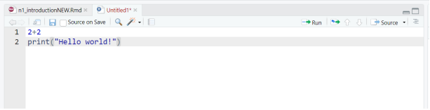
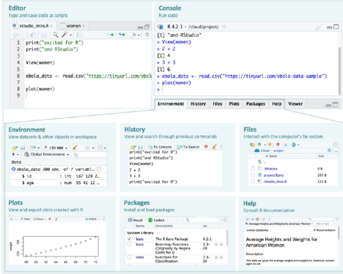
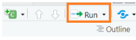

```{r setup1, include=FALSE}
library(knitr)
library(cowplot) #Gives more control for figures

knitr::opts_chunk$set(
  warnings = FALSE,
  fig.path = 'figs/',
  message = FALSE,
  digits = 3,
  skimr_digits = 3
)
options(digits = 7, pillar.sigfig = 3)

```

# Introduction

```{js, echo = FALSE}
title=document.getElementById('header');
title.innerHTML = '' + title.innerHTML
```

This is an online course from the [African Foundational Learning Data Hub](https://www.datafirst.uct.ac.za/aflearn) at DataFirst. It is aimed at analysts and researchers who work with household survey data on children's foundational learning. You may be comfortable with Excel or Stata but new to R, or you may also be returning to quantitative work after time in the field. The course assumes no prior programming experience. It does assume familiarity with basic statistical ideas such as means, proportions, correlation, and the logic of regression.

Throughout the course you will work with the [ICAN-ICAR 2025](https://palnetwork.org/ican-icar/) household survey. This is a nationally representative, household-based study of children aged 5-16, covering foundational numeracy and reading across multiple countries. The dataset is large (tens of thousands of children and households) and rich in policy-relevant variables, such as reading and mathematics ability scores, minimum proficiency indicators, enrolment and grade, household composition, and assessment context. By using one real survey end to end, you learn skills that transfer directly to population-level reporting and research, not only to describing the particular sample in front of you.

The teaching approach is hands-on and cumulative. Each chapter builds on the last, with guided practice, independent exercises, and code you can adapt to your own questions. A central theme is survey-aware analysis: ICAN-ICAR uses a stratified, multi-stage cluster design with household weights. The course explains why unweighted tables can misrepresent the population, how weight and design variables enter the analysis, and how to obtain design-correct estimates, and standard errors in R. A second theme is reproducibility: organizing work in RStudio projects, writing scripts, chaining steps with readable pipelines, and saving outputs such as tables and figures.

## What you will learn

By the end of the course you should be able to use R and RStudio for a complete workflow, from opening data and exploring it, through weighted descriptive analysis, to regression models suited to continuous and binary outcomes, with attention to sampling design throughout.

The material is organized in three parts.

### Part I - Getting started in R (Chapters 2-3)

You learn the RStudio environment. This includes the script editor, console, environment and history, files, plots, packages, and help. You organize a project folder, install and load packages, and write your first scripts. You then study core R concepts, such as arithmetic and assignment, vectors and data frames, missing values, matrices, and basic control flow. The foundation supports everything that follows.

### Part II - Exploring and preparing data (Chapters 4-6)

You visualize data with ggplot2, using the grammar-of-graphics pattern (data, aesthetics, geoms) to build scatterplots and other charts of reading and mathematics scores and related variables. You wrangle data with dplyr: filter, arrange, select, mutate, summarise, and group by, combined with the pipe operator for clear, step-by-step workflows on ICAN-ICAR 2025. You then turn to survey design: probability sampling, multi-stage selection, survey weights, and constructing a design object with the survey package.

### Part III - Describing and modelling learning outcomes (Chapters 7 - 12)

You describe how variables are distributed, i.e., continuous, ordinal and categorical, and produce weighted summaries that reflect the target population. You compute and interpret measures of central tendency and dispersion (mean, median, mode, standard deviation, interquartile range), including weighted and design-correct versions. Bivariate analysis covers cross-tabulations, group comparisons, scatterplots, and chi-squared tests, with survey-weighted counterparts where inference matters. You then move to regression: simple and multiple linear models relating outcomes such as literacy or numeracy scores to predictors like grade, age, gender, and location; and logistic regression for binary outcomes such as meeting minimum proficiency in reading and mathematics. Models are fit with survey weights and clustering so that coefficients and uncertainty statements align with the study design.

## What you need

Install R and RStudio. Chapters packages including tidyverse, survey, ggplot2, broom and knitr. Download the ICAN-ICAR 2025 file from [DataFirst](https://www.datafirst.uct.ac.za/dataportal/index.php/catalog/1132) and place it in your *data/* folder inside your course project, as described in the wrangling chapter.

If your work concerns whether children meet foundational learning benchmarks, how skills vary by age, grade, or place of residence, how to report results that represent populations rather than convenience samples, this course is intended to give you a practical path through those questions in R, from your first "Hello Word!" to design-correct models of minimum proficiency.

<!--chapter:end:index.Rmd-->

---
editor_options: 
  markdown: 
    wrap: sentence
---

# Getting Started with R

## RStudio interface

RStudio opens with four panes by default.
If you only see three, create a new script to reveal the Source pane: File -\> New File -\> R Script (shortcut: <kbd>Control</kbd>+<kbd>Shift</kbd> + <kbd>N</kbd> on Windows/Linux, <kbd>Command</kbd>+<kbd>Shift</kbd> + <kbd>N</kbd> on Mac).


<br>

The diagram below summarises the different parts of RStudio.



<br>

**Basic layout**

-   Four panels and various tabs

    -   **Top-left** - where you type source code, like the script editor in Stata.

    -   **Bottom-left** - is the Console, where you see what R is doing.

    -   **Upper-right** - where you see your list of R objects and things in your Workspace (explained in the sections to follow).
        There is also a history tab where you find the history of all your commands in that session.
        Recent versions of RStudio have another tab, **Tutorial**, for integrated tutorials powered by the `learnr` package.

    -   **Bottom-right** is where you can see your file structure, graphical output, available packages, and help documents.

We now consider these one by one.

### Source/ Editor

 <br> You'll do most of your coding here, so it's helpful to give this pane more space in your layout.
Type code in the editor, then run a line or selection with Ctrl+Enter (Windows/Linux) or Cmd+Enter (Mac); results show in the Console.

### Example: Running a line of code in the Editor

**Example: Running a line of code**

Let’s begin by learning how to write and run code from the Source pane.

1.  Open a new script:

    Go to **File -\> New File -\> R Script**.

    A new blank tab appears in the Source pane.
    <br>\

2.  Type this line:

```{r, echo=TRUE, results='hide'}
print("Hello world!")
```

3.  Run the line:

-   On Windows - press <kbd>Control</kbd> + <kbd>Enter</kbd>
-   On macOS - press <kbd>Command</kbd> + <kbd>Enter</kbd>

RStudio sends the line to the Console (lower-left pane), runs it, and shows:

```{r, echo=FALSE}
print("Hello world!")
```

**Guided Practice — Running Multiple Lines of Code**

Now you’ll extend that first example step by step.

1.  Add another line so your script looks like this:

```{r, echo=TRUE, results='hide'}
print("Hello world!")
print("I am learning R!")
```

2.  Highlight both lines with your mouse or keyboard.

3.  Run them together: <kbd>Ctrl</kbd> + <kbd>Enter</kbd> (Windows) or <kbd>Cmd</kbd> + <kbd>Enter</kbd> (Mac)

Both lines should now appear in the console output

**Independent Practice**

Your turn!

1.  Add a new line that prints your own message:

```{r, echo=TRUE, results='hide'}
print("Learning R feels great!") # This is an example add you own message
```

2.  Run just that line and check the result.

3.  Select all your code (<kbd>Cmd</kbd>/<kbd>Ctrl</kbd> + <kbd>A</kbd>) and run the entire script (<kbd>Cmd</kbd>/<kbd>Ctrl</kbd> + <kbd>Enter</kbd>).

You should see three printed messages in the Console, one after another.

Tip: There is also a **Run** button at the top-right of the Source pane <br>

 <br> It runs the current line or any highlighted lines.
You can use it, but prefer the keyboard shortcut for speed: <kbd>Cmd</kbd>/<kbd>Ctrl</kbd> + <kbd>Enter</kbd>.

**Saving your script** To save the script, press

<kbd>Ctrl/Cmd</kbd> + <kbd>S</kbd>

Give the file a name such as r_introduction.R or your preferred name.
Save it somewhere easy to find, like the Desktop.
(Later, you’ll learn better ways to organize your scripts inside "projects".)

### Console

The Console (bottom-left pane in RStudio) is where R actually runs your code.
When you send commands from the **Source (Editor)** pane or type directly into the Console, R executes them immediately and prints the output below the typed command.
Think of it as your conversation window with R - you type a command, R responds.

**Example: Running Code in the Console**

Let’s see how the Console works.

1.  Click inside the Console pane.

2.  Type a simple calculation:

```{r echo=TRUE, results='hide'}
5 + 3
```

Press <kbd>Enter</kbd>

You should see:

```{r echo=FALSE}
5 + 3
```

The code was run instantly.
Everything typed directly in the Console is not saved, so use it mainly for quick checks.

**Guided Practice - Trying Different Commands**

Now try a few more examples:

1.  Type:

```{r echo=TRUE, results='hide'}
10 / 2
```

Then press <kbd>Enter</kbd>

2.  Next, type:

```{r echo=TRUE, results='hide'}
sqrt(16)
```

Then press <kbd>Enter</kbd>

You will see **5** and **4** as the results of each command

3.  Type

```{r echo=TRUE, results='hide'}
3 * (2 + 4)
```

and run it.

Each time you press <kbd>Enter</kbd>, R immediately performs the calculation and prints the output.

**Tip**: You can recall your last command by pressing the **Up Arrow** on the keyboard.
Once you have recalled it, you can edit if needed and press <kbd>Enter</kbd> to run again.

**Independent Practice**

Now it’s your turn to explore.

1.  Type a few calculations of your own, such as:

-   12 - 5
-   4 \^ 2
-   log(100)

2.  Run each line by pressing Enter after typing.

3.  Notice how R prints the result directly below each command.

When you type directly in the Console, R executes commands immediately but does not store them.
For any code you want to save and reuse, make sure to write it in a **script** (in the **Source pane**) and run it from there.

### Environment Tab

The Environment tab, usually, the **top-right pane**, shows all the objects currently stored in R’s working memory, your workspace.
Every time you create a new object (like a dataset, variable, or function), it appears in this list.

You can think of the Environment as R’s memory view, it keeps track of everything you have created during your session.

**Example: Watching the Environment Update**

Let us see what happens in the Environment tab when you create something R wants to remember.

1.  In your script (Source pane), type:

```{r echo=TRUE, results='hide'}
x <- 5 + 3
```

2.  Run the line (<kbd>Cmd</kbd>/<kbd>Ctrl</kbd> + <kbd>Enter</kbd>).

Look at the **Environment tab** (top-right).
You should now see an entry labelled x with a value of 8.

Whenever R stores something, even a simple calculation like this, it keeps track of it in the Environment.
Later, we will learn what these stored things (called objects) are and how to manage them.

**Guided Practice - Exploring What the Environment Shows**

Try a few more examples:

1.  Add these lines to your script and run them one by one:

```{r echo=TRUE, results='hide'}
y <- 12
z <- x + y
```

2.  Watch how new entries appear in the Environment tab each time you run a line.

3.  Click the small blue triangle next to any name to see a quick summary of what it contains.

The Environment pane updates in real time as you work.
It’s a visual way of seeing what R is keeping track of.

**Independent Practice**

Now try this small challenge:

1.  Create and run one or two short calculations of your own, such as:

```{r echo=TRUE, results='hide'}
a <- 4 + 6
b <- a * 2
```

2.  Check that each new name appears in the Environment with its value beside it.

3.  Use the broom icon at the top of the Environment pane to clear everything.

4.  Run one line again - see how the Environment repopulates with just that result.

Clearing the Environment does not affect your code.
It only removes what R has stored in memory for now

### History Tab

The **History** tab (next to the **Environment** tab, top-right pane) keeps a running list of all the commands you have run during your R session - whether they were typed directly into the Console or sent from a script.

Think of it as RStudio’s built-in “memory log” - a quick way to review what you have done or re-use code you ran earlier.

**Example: Viewing Your Command History**

Let us see what appears in the History tab.

1.  In your script or Console, run a few simple commands:

```{r echo=TRUE, results='hide'}
5 + 3
print("Hello R")
10 / 2
```

2.  Now look at the History tab (top-right, next to Environment). You’ll see each of these commands listed in order.

Each time you run a line of code, RStudio automatically records it in the History tab.
This makes it easy to revisit or reuse commands without retyping them.

**Guided Practice: Sending Commands from History**

You can reuse past commands directly from the History tab.

1.  Click on one of your earlier commands in the History list (for example, 5 + 3).

2.  At the top of the History tab, click “To Console”, the command will appear in the Console, ready to run.

3.  Try “To Source” — this sends the same command to your script instead, where you can save it or edit it.

**Tip**: The commands recorded in the History tab help you to recover something youran earlier but did not save in a script - no need to retype!

**Independent Practice**

Now try this on your own:

1.  Type and run a few new lines of code, such as:

```{r echo=TRUE, results='hide'}
2^4
print("R is fun!")
7 * 9
```

2.  Open the History tab.

    -   Use the Shift-click method to select several lines at once (click the first line, hold Shift, then click the last).

    -   Send them all back to the Console or Source using the buttons at the top of the tab.

3.  Experiment with the Search bar (top-right of the History pane) — try typing part of a command like **print or 7** to find related lines quickly.

### Files Tab

The Files tab (bottom-right pane in RStudio) shows the files and folders in the folder where RStudio is currently working — this is called your "working directory" Think of it as a small file explorer built right into RStudio - we will revisit this including how it is set up.
From here, you can create, open, rename, and delete files and folders without leaving RStudio.

**Example: Exploring the Files Tab**

Let us take a quick look at what the Files tab can do.

1.  Open RStudio and locate the Files tab in the bottom-right pane.

2.  Look at the list — these are the files and folders in your current workspace.

3.  Click the New Folder button at the top of the tab.

    -   Give your folder a name such as test_folder and click <kbd>OK</kbd>.

    -   The folder appears in the list.

The Files tab lets you interact with your computer’s folders and files directly inside RStudio, keeping everything related to your R work in one place.

**Guided Practice - Managing Files and Folders**

Now, try a few more options in the toolbar.

1.Click on the new folder to open it.

2.  Inside, choose New File -\> R Script, name it practice_script.R, and click <kbd>OK</kbd>.

3.  Use the Rename button to rename it to first_script.R.

4.  Finally, try the Delete button to remove either the script or the folder (RStudio will ask for confirmation).

**Independent Practice** Take a few minutes to explore on your own:

1.  Create another new folder and name it anything you like.

2.  Use the **Up Directory (↑)** button to move back to the parent folder.

3.  Try the Refresh button to update the view if something changes.

4.  Explore the More… menu to see extra options (for example, “Show Folder in New Window”).

### Plots Tab

The **Plots** tab (bottom-right pane in RStudio, next to the Files tab) is where any figures or graphs you create in R will appear.
Whenever you run a plotting command, RStudio automatically displays the resulting figure here.

**Example: Creating Your First Plot**

Let us make a simple plot to see how this tab works.

1.  In your script, type:

```{r echo=TRUE, results='hide', fig.show='hide'}
plot(women)
```

2.  Run the line (<kbd>Cmd</kbd>/<kbd>Ctrl</kbd> + <kbd>Enter</kbd>).

You should see a scatterplot appear in the Plots tab.

The dataset women is built into R.
It contains average heights and weights of American women aged 30 – 39.
We are not analysing it yet, we are just using it to see where plots show up in RStudio.

**Guided Practice — Exploring the Plot Tools**

Now, take a moment to look at the toolbar at the top of the Plots tab:

1.  Use the **← / →** arrows to move between plots if you create more than one.

2.  Click Zoom to open the plot in a larger window.

3.  Click Export **→** Save as Image or Save as PDF to save a copy of the plot to your computer.

4.  Click the broom (🧹) icon to clear all plots from the tab.

**Independent practice**

Try making a few variations:

```{r echo=TRUE, results='hide', fig.show='hide'}
plot(women$height, women$weight)
plot(women, type = "b")     # adds lines between the points
plot(women, main = "Heights and Weights of Women")
```

Each time you run a line, a new plot appears in the Plots tab.
Use the navigation arrows to move between them and experiment with the Zoom and Export buttons.

### Packages Tab

The **Packages** tab (bottom-right pane, next to **Plots** and **Help**) shows all the packages currently installed on your computer.

Packages are collections of R code that add new tools or features to R — such as new plotting styles, data import functions, or analysis methods.
You will learn how to install and use them later in the course.

**Example: Exploring the Packages Tab**

Let us look at what is inside the Packages tab.

1.  Click on the Packages tab (bottom-right pane).

2.  Scroll through the list — each item (in blue) is the name of an installed package.

3.  Packages with a checkmark (**✔**) are loaded, these are the ones currently active and ready to use.

R always loads a few essential packages automatically when it starts (for example, “stats” and “graphics”).
The rest are available but inactive until you load them.

**Guided Practice — Finding and Installing Packages**

Let us explore the buttons at the top of the tab.

1.  Click the Install button — you’ll see a small window that asks for a package name.

2.  You don’t need to install anything now; just notice how it works.

3.  The Update button checks if newer versions of your installed packages are available.

The Loaded Only checkbox filters the view so you see only packages currently in use.

Tip: Although you can install packages from this tab, we’ll learn a more efficient and reproducible way - by using R code (**install.packages()** and **library()**) - in a later lesson.

**Independent practice**

Take a few minutes to explore:

1.  Scroll through the list and see which packages have checkmarks.

2.  Use the Search bar (top-right of the tab) to find a package called graphics - this is one of R’s built-in packages that handles plotting.

3.  Click the Help button at the top to open documentation for a selected package.

*Try this*: Run a quick plot again to confirm that packages like graphics are already working for you:

```{r echo=TRUE, results='hide', fig.show='hide'}
plot(women)
```

The **plot()** function comes from the graphics package, which R loads automatically when it starts.

### Help Tab

The **Help** tab (bottom-right pane) shows documentation for R functions, datasets, and packages.
Help pages can feel dense at first, but they become invaluable as you learn the layout.

Typical sections you’ll see:

-   **Description** - what it does

-   **Usage** - how to call it

-   **Arguments** - what each input means

-   **Value** - what it returns

-   **Examples** - try-it code at the bottom

**Example: Opening Help**

Try these, one at a time (run each line):

```{r echo=TRUE, results='hide', eval=FALSE}
?plot          # help for the plot() function
?women         # help for the built-in dataset 'women'
help("print")  # another way to open help
```

**Tip**: In RStudio, place your cursor on a function name (e.g., plot) and press F1 to open its Help page.

**Guided Practice — Searching Help**

Explore a few ways to find help:

1.  In the Help tab’s search box (top), type plot and hit Enter.

2.  In the Console, try a topic search (broader than ?):

```{r echo=TRUE, results='hide', eval=FALSE}
??histogram     # search help topics containing "histogram"
```

3.  Scroll to the **Examples** section of a help page and click Run examples (or copy an example into your script and run it).

**Independent Practice**

Try these quick tasks:

1.  Open help for View:

```{r echo=TRUE, results='hide', , eval=FALSE}
?View
```

2.  Skim the Arguments section to see what View() accepts.

3.  Open help for the women dataset again:

```{r echo=TRUE, eval=FALSE}
?women
```

-   Find the short description of what the dataset contains.

4.  Use F1 on the word plot in your script to open its help directly.

<!-- ### Quick start: your first R session -->

<!-- 1. Install R from [CRAN](https://cran.r-project.org/). -->

<!-- 2. Install RStudio from [rstudio.com](https://www.rstudio.com/). -->

<!-- 3. Open the project file `Intro to R Nov 2025.Rproj`. -->

<!-- 4. Create a new R Script (`File -> New File -> R Script`). -->

<!-- 5. Type `x <- 3` and run it: `Ctrl + Enter` (Windows) / `Cmd + Return` (Mac). -->

<!-- 6. Confirm in the Environment pane that `x` appears, then try `x * 2`. -->

<!-- ### Try it now (2 minutes) -->

<!-- ```{r, eval=FALSE} -->

<!-- # What R version am I running? -->

<!-- R.version.string -->

<!-- # Use help to see documentation and examples -->

<!-- ?mean -->

<!-- # Run a simple calculation -->

<!-- mean(c(1, 2, 3)) -->

<!-- # Explore a built-in dataset -->

<!-- head(mtcars) -->

<!-- summary(mtcars$mpg) -->

<!-- ``` -->

## Organize your R session

**Commands**

Now that you’ve explored the RStudio interface and know how to run code, let us look at the structure of R commands.

R follows a simple pattern when you ask it to do something:

`> command(argument1, argument2, ...,)`

For example:

```{r echo=TRUE, results='hide', , eval=FALSE}
print("Hello, R!")
```

Each command name is followed by parentheses () that contain the information (called arguments) R needs to perform the task.
Even if no information is required, the parentheses are still needed to tell R to do something.

**Guided practice**

Let’s try a few examples together:

```{r echo=TRUE, eval=FALSE}
2 + 3
sum(10, 25)
sqrt(16)
```

Each line is a different command that tells R to perform a task — adding, summing, or finding a square root.

### Working Directory: Where R Looks for Your Files

-   Your working directory is the folder where R looks for files to read and where it saves anything you create.
    Think of it as R’s current workspace on your computer.

-   You can check it in RStudio Console:

`getwd()` - This command shows the folder R is currently using.

#### Set working directory

One can set or change the working directory in RStudio (Session) using the following command:

`setwd("path_to_directory")` - Set another working directory

However, managing your working directories this way is not efficient.

-   **Problem**: If you rely on setwd(), your code may break/fail on another computer, since everyone has different file paths.

It is good practice to keep all your data and other material related to a specific project in a single folder, the working directory.
An example of this file hierarchy/folder structure is shown below:

``` text
└── my_project
    ├── data
    │   ├── raw
    │   └── cleaned
    ├── figures
    ├── output
    └── script
        ├── 1_data_prep.R
        └── 2_data_analysis.R
```

`my_project`- your main folder containing the following sub-directories:

`data` folder with sub-directories, `raw` for the raw data and `cleaned` for the processed data.

`figures` folder for saving your plots.

`output` folder for storing other outputs that are not figures, e.g. aggregated tables.

`script` folder storing R scripts.

You can then use **RStudio projects** to manage your working directory.
RStudio projects enable you to use relative paths to files and folders inside your main project folder (as opposed to absolute paths, that is, the full path to a file or folder).
RStudio projects remember the location of your main folder and allow you to easily navigate to sub-folders without the need to remember their full path.
With RStudio projects, RStudio also remembers the files you had open the last time you closed a project.
The next time you open your project, RStudio will open the same files and tabs.

#### Creating a RStudio project

RStudio can create new projects using three different methods: **New Directory**, **Existing Directory**, or **Version Control**.
Assuming we have an existing project folder, `my_project`, as above:

1.  Start RStudio.

2.  Go to `File` then click on `New Project`.
    Choose `Existing Directory`, then New Project.

3.  Under the `project working directory:`, browse to the `my_project` folder.

4.  Click on `Create Project`.

In your `my_project` folder, you will find a new `my_project.Rproj` file created as illustrated below.

``` text
└── my_project
  ├── data
  │   ├── raw
  │   └── cleaned
  ├── figures
  ├── output
  ├── script
  │    ├── 1_data_prep.R
  │    └── 2_data_analysis.R
  └── my_project.Rproj
  
```

The next time you want to open this project, you can just double click the `my_project.Rproj` or the file with file extension `.Rproj`.
Note that the `my_project` can be any name for your project.
You can now navigate to sub-folders in your main folder, e.g., `./data/raw` as opposed to say `C:/some_long_path_name/my_project/data/raw`.
More on using relative path when we start importing data and saving files in sections to follow.
For this course, the RStudio project file is `Intro to R Nov 2025.Rproj` in the folder.

### Installing and Loading Packages (Libraries)

#### What is a package?

-   Once again, a **package** (or library) is a collection of extra functions that extend what R can do.

-   You could think of them as the apps you install on your phone ???
    they add new features.

Often you will find that you may need to use functions from other user-written packages or libraries.
Since these packages do not come installed in base R, you need to do the additional installation yourself.
To install a package called `lattice`for instance, type the following in your R Console (and press `Enter`) or in a script (and press `Run`):

`install.packages("lattice")`

Developers of these packages usually update them after introducing new functions or changing names of certain functionality, so be aware that behavior can change across versions.

You also need to load the package/library into the R workspace before you can use functions from that library as follows:

`library(lattice)`

You need to load the library each time you need to use it in a new R session.

#### Quick Tips for Beginners:

-   Install once - load every time you start R.

-   If you forget to load, R will say: "could not find function ."

-   Packages get updated, so sometimes behavior may change across versions.

### Comments in R

`#` denotes a comment in R

Anything after the `#` is not evaluated and is ignored in R

### Common mistakes and quick fixes

-   Assignment: prefer `<-` for assigning values (e.g., `x <- 5`). Using `=` can work but is harder to read in function calls.
-   Quotes: match your quotes exactly, e.g., "text" or 'text', not a mix.
-   Commas: separate function arguments with commas, e.g., `mean(x, na.rm = TRUE)`.
-   Pipes: the native pipe `|>` passes the left-hand result into the next function, e.g., `mtcars |> head()`.
-   Reading errors: read the first line of the error; it usually tells you which function failed and why. Copy the minimal failing line and try it alone in the Console.

## Getting help

-   `help(solve)` or `?solve` - to get help for command `solve`, type:

    -   this is useful only if you already know the name of the function that you wish to use.

-   `apropos()` - searches for objects, including functions, directly accessible in the current R session that have names that include a specified character string.

-   `help.search("solve")` and `??solve` - scans the documentation for packages installed in your library for commands which could be related to the string "solve"

-   `help.start()` - Start the hypertext (currently HTML) version of R's online documentation.

-   `RSiteSearch()` - uses an internet search engine to search for information in function help pages.

-   `example(exp)` - examples for the usage of exp

-   `example("*")` - special characters have to be in quotation marks

-   For tricky questions, error messages and other issues, use [Google](https://www.google.com/) (include "in R" to the end of your query).

-   We can also use [RSeek](https://rseek.org/) - the search engine just for `R`.

-   [StackOverflow](https://stackoverflow.com/) - great resource with many questions for many specific packages in R and a rating system for answers

## Operators in R

### Basic arithmetic operators

You have already used R for basic calculations.
Now let’s summarise the key arithmetic operators you’ll use often.

**Examples of Common Operators**

```{r echo=TRUE, echo=TRUE}
2 + 3     # Addition
7 - 4     # Subtraction
3 * 5     # Multiplication
7 / 3     # Division
5 ^ 2     # Exponent (power)
```

R follows the normal order of operations (brackets → exponents → multiplication/division → addition/subtraction).
Use brackets () to control the order:

```{r echo=TRUE, echo=TRUE}
(3 + 5) * 2
```

**Guided practice - New Operators to Explore**

Let us try these together:

```{r echo=TRUE, eval=FALSE}
150 %/% 60   # integer division – whole hours in 150 minutes
150 %% 60    # remainder – minutes left over
```

%/% gives the whole number part of a division, and %% gives the remainder.

**Independent Practice**

Use what you have learned:

``` text
(10 - 3) * 4
9 ^ 0.5
245 %/% 60
245 %% 60
```

Then experiment with built-in math functions:

``` text
sqrt(25)
log(10)
exp(2)
```

**Reflection**: You now know how R handles arithmetic, powers, remainders, and simple math functions—all tools you will use constantly as you analyse data.

### Assignment operator

In R, we often want to store a value so we can use it later.
To do this, we use the assignment operator `<-`, which means “assign the value on the right to the name on the left.”

Example

Let’s create a simple value and look at it.

```{r, echo=T}
x <- 3
x
```

Here, `x` is the name, and 3 is the value stored in it.
When you type `x` and press Enter, R shows what is inside—3.

**Tip**: You can also use = for assignment, but in R we usually prefer `<-` because it is easier to read in longer code.

**Guided practice**

Let us try a few examples:

```{r, eval=FALSE}
y <- 10
z <- x + y
z
```

**Independent practice**

Now it’s your turn.

1.  Assign the value 8 to a name of your choice (for example, a).

2.  Create another value (for example, b \<- 2).

3.  Add them together to make a new name (for example, c \<- a + b).

4.  Type each name to see what’s stored inside.

Example to guide you:

``` text
a <- 8
b <- 2
c <- a + b
c
```

### Sequence operator

`:` .
To get the sequence of numbers/integers from 1 to 10, type the following: In R, the colon (`:`) is the sequence operator.
It is used to create a quick sequence of numbers.
It is a shortcut for making a list of numbers that increase (or decrease) by 1.

For example:

```{r, eval=FALSE}
a <- 1:10 # it increments by one
a
```

R creates the numbers 1 through 10 and stores them in `a`.
When you type `a`, R shows:

```{r, echo=FALSE}
a <- 1:10 # it increments by one
a
```

**Tip**: The colon operator works both ways - try 10:1 to count down!

**Independent practice**

1.  Create a sequence from 5 to 15 and store it in a name of your choice.
2.  Print it to see the result.
3.  Try counting backwards from 20 to 10.

Example to guide you:

``` text
b <- 5:15
b

c <- 20:10
c
```

**Reflection**: The `:` operator is a quick way to make number sequences in R — no typing each number by hand!

## Objects in R

When you run a command, R shows the result in the Console, but it is not saved for later.
To keep a result, assign it to a name (an **object**) using the assignment operator `<-`, which you can read as “gets”.

**Note on `=`** You can assign with `=`, but most R code uses `<-`.
Follow the common convention and prefer `<-`.

**Example - Console result vs saved value**

```{r, echo=TRUE}
2 + 2        # R prints the result but does NOT save it

```

Now save (assign) the result:

```{r, echo=TRUE}
my_obj <- 2 + 2   # "my_obj gets 2 + 2"
my_obj            # print what's stored

```

-   my_obj is the name.

-   2 + 2 is the value R calculated before storing.

-   You can now use my_obj anywhere.

-   Look at the Environment tab: you’ll see my_obj listed there.

**Guided Practice - Make and update objects**

Create and view a few objects:

```{r, eval=FALSE}
first_name <- "Joanna"
first_name

x <- 20
x
```

Update a value:

```{r, eval=FALSE}
x <- x + 5   # take the current x and add 5
x
```

**Tip**: The Environment tab updates as you create/change objects.

**Independent practice**

1.  Store a number and reuse it

```{r, eval=FALSE}
a <- 100
b <- sqrt(a)
b
```

2.  Create a greeting

```{r, eval=FALSE}
name <- "Chifundo"
greeting <- paste("Hello,", name)
greeting
```

-   An object is a named bucket that holds a value (number, text, data, …).

-   Use \<- to assign: name \<- value.

-   The Environment tab shows everything R currently remembers.

-   R evaluates the expression on the right first, then stores the result on the left.

## Managing the workspace

As we create more objects in the workspace, we also need to manage and manipulate the workspace.
All the R objects that we have created are stored in the memory of the computer.
Over time, unnecessary objects can clutter your workspace and slow things down, so it is good practice to keep it tidy.
R makes organizing the workspace easy.
Let's create a few more objects and show how to remove some of these from memory:

```{r}
z <- 3
```

We can list or ask R to display all the objects in memory using the `ls()` function:

```{r}
ls()  #list all variables
```

We can also list and describe the variables using the `ls.str()` function:

```{r}
ls.str()  #list and describe variables
```

Assuming we no longer need object `x` in the workspace, we can remove it from memory using the `rm()` function:

```{r}
rm(x)  # delete a variable
```

We can list again all the objects in memory and confirm that `x` has been removed.

```{r}
ls()
```

We are now left with objects `a` and `z`.

-   To remove everything in the workspace

```{r, eval=FALSE}
rm(list = ls())
```

## Some language features

It might be helpful to be aware of the following (taken from [Jared Knowles R Bootcamp](https://www.jaredknowles.com/r-bootcamp/)):

-   R is inconsistent in its naming conventions

    -   Some functions are `camelCase`; others are `dot.separated`; others `use_underscores`.

-   Function results are stored in a variety of ways across function implementations.

-   R has multiple graphics packages that different functions use for default plot construction (base, grid, lattice, and ggplot2)

-   R has multiple packages and functions to perform the same tasks.

-   Be flexible and be aware of R's flexibility

The next notebook introduces some common types of objects.

Glossary (quick definitions):

-   object: a named thing stored in R (e.g., a number, vector, data frame)

-   function: a reusable command that does work, written like `name()`

-   package: a collection of functions and help files you can install and load

## Test your knowledge

**Assignment and operators**

1.  Assign the variables, `height` to be 175cm and `weight` to be 80kg.

```{r, eval = FALSE}
height <- 

weight <- 
```

2.  Calculate BMI assuming the formula below and your variables:

$$BMI = \frac{weight(kg)}{height(m)^2}$$

```{r, eval = FALSE}
bmi <- 
```

```{r, echo=FALSE, eval=FALSE}
# Hidden solution (uncomment and adapt units):
# Convert height to meters if given in cm
# height_m <- height / 100
# bmi <- weight / (height_m ^ 2)
```

## Session information

Below is the session information, which records the R version and packages used.

```{r, echo=T}
print(sessionInfo())
```

## Acknowledgements

This material was largely adapted from the following sources:

Jared Knowles [R Bootcamp for Education](https://www.jaredknowles.com/r-bootcamp/) - under the [Creative Commons Public Domain Mark](https://creativecommons.org/publicdomain/mark/1.0/)

[Software Carpentry](http://software-carpentry.org) , [Lesson Material](https://resbaz.github.io/2014-r-materials/lessons/index.html), [R for reproducible scientific analysis](http://resbaz.github.io/r-novice-gapminder/) - under the [Creative Commons Attribution license](https://creativecommons.org/licenses/by/3.0/)

<!--chapter:end:01-getting-started.Rmd-->

# R Basics

## Scalar Arithmetic

R has the usual arithmetic operators:

-   \+ for addition

-   \- for subtraction

-   \* for multiplication

-   / for division

-   \^ for raising to a power

-   \% / % for integer division

-   %% for remainder from integer division

There is also an arithmetic operator "-" for unary minus that is applicable to one operand (i.e., making a negative value; "+" can also be used as unary plus). For example, the following expression yields, based on the order of operations (i.e., \^ first, \*/ second, and + - last, from left to right if the orders are the same), the answer shown here:

```{r}
1 + 2 - 3 * 4 / 5 ^ 6

```

The number in the brackets (e.g., [1]) indicates the order of elements in the result. Because we are getting a scalar value, only one number is shown after such a bracketed number. This will be handy where we operate with vectors instead of scalars. The order of operations can be changed with the use of parentheses. For example:

```{r}
(1 + 2 - 3) * 4 / 5 ^ 6 
```

```{r}
1 + 2 - (3 * 4 / 5) ^ 6
```

```{r}
1 + (2 - 3) * 4 / 5 ^ 6

```

```{r}
1 + (2 - 3) * (4 / 5) ^ 6
```

The portions of the expression beginning with the pound symbol, #, to the end of the expression before running the expression will be treated as a comment. For example,

```{r}
6 + 5 - 4 * 3 / 2 ^ 1  # the answer is [Enter]

```

Comments can be typed (and ignored) anywhere in the R expressions. Comments can be very informative explaining the expression to be carried by R.

The default number of decimal places is 7. It can be changed with the `options()` function with the digits argument for which the valid values are $0 - 22$. It should be noted that there may exist rounding errors when a very larger number of decimal places, say $22$, is employed. For example, $1/3$ will yield $0.3333333$ in the default setting, but the following rounding error can occur when a higher precision is requested:

```{r}
options(digits = 22)
1/3 
```

With the same `options()` function in effect, the mathematical constant $\pi$ can be obtained using R both directly with the `pi` command and indirectly with the arc tangent function:

```{r}
pi 
```

```{r include=FALSE}
options(digits = 2)
```


```{r}
4 * atan(1)
```

Other mathematical constants can be obtained using R functions. In fact, nearly all of the common mathematical function are available in R with arguments in parentheses (i.e., parenthetical arguments). For example, mathematical functions include:

-   `abs()` - absolute value

-   `exp()` - exponential (*e* to a power)

-   `gamma()` - gamma function

-   `lgamma()` - log of gamma function

-   `log()` - logarithm

-   `log10()` - logarithm of base 10

-   `sign()` - signum function

-   `sqrt()` - square root

-   `floor()` - largest integer, less than or equal to

-   `ceiling()` - smallest integer, greater than or equal to

-   `trunc()` - truncation to the nearest integer

-   `factorial()` - factorial

-   `lfactorial()` - log of factorial

A full range of logical operators can be used in R:

-   `>` - greater than

-   `<` - less than

-   `>=` - greater than or equal to

-   `<=` - less than or equal to

-   `==` - equality

-   `!=` - non-equality

-   `&` - elementwise AND

-   `|` - elementwise OR

-   `&&` - control AND

-   `||` - control OR

-   `!` - unary not

In the trigonometric functions, the arguments are in radians instead of degrees. For example:

```{r}
sin(pi / 6)
```

```{r}
pi / 6
```

```{r}
sin(0.5235988)
```

```{r}
sin((30 / 180) * pi)
```

A scalar value or the result from arithmetic operators can be saved as a variable with the assignment function `<-` or `=`. The value can be listed by typing in the variable name:

```{r}
a = sin(pi / 6)

b = cos(pi / 6)

c = sqrt(a ^ 2 + b ^ 2)

c
```

Multiple expressions can be combined by separating them with semi-colons. Spaces are mostly optional in the R commands, but readability will be enhanced when proper spacing is employed. For example,

```{r}
a = sin(pi/6); b = cos(pi/6); c = sqrt(a ^ 2 + b ^ 2); c
```

R can handle operations of complex numbers that have real parts and imaginary parts albeit not really useful in applied statistical procedures:

```{r}
x = 4 + 2i
Re(x)
```

```{r}
Im(x)
```

```{r}
y = 4 - 2i
x + y

```

```{r}
x * y
```

## Vector Arithmetic

Here, a vector is an ordered collection of values of the same type stored under one variable name. In fact, even a single value is technically a vector of length one. Usually, when we say vector we mean a structure with multiple elements. One can have numeric vectors (i.e., a series of numbers), a character of vectors (i.e., a series of strings), or logical vectors (TRUE or FALSE values). The key rule is all elements in a vector must be of the same class or type.

If one mixes types, R will automatically coerce them to a common type so that the whole vector is uniform. For example, combining numbers and strings in one vector will turn all values into strings behind the hood.

To define the vector, we use the concatenation function `c()` and list all the values:

```{r}
x = c(1, 2, 3)
```

After defining the vector (i.e., a variable in a statistical sense), the elements of the vector can be listed by typing in the name of the vector:

```{r}
x
```

A character vector of names will be

```{r}
names = c('Alice', 'Thabo', 'Zola')
names
```

One can perform operations on vectors easily. Functions for simple statistics for a vector are available in R:

-   `min()` - smallest value

-   `max()` - largest value

-   `range()` - minimum and maximum

-   `mean()` - arithmetic average

-   `var()` - variance

-   `sd()` - standard deviation

-   `sum()` - arithmetic sum

-   `prod()` - product of elements

-   `length()` - number of elements

-   `median()` - 50th percentile

-   `quantile()` - quantiles

-   `cumsum()` - cumulative sum

-   `diff()` - first difference

-   `table()` - frequency table or cross tabulation

-   `summary()` - five number summary or frequencies

In addition, after defining two vectors, the following statistical functions are available in R:

-   `cor()` - correlation

-   `cov()` - covariance

For example:

```{r}
x = c(1, 2, 3, 2)
y = c(1, 3, 2, 2) 

# compute correlation between the two numeric vectors 
cor(x, y)
```

```{r}
# compute covariance between the two numeric vectors 
cov(x, y)
```

Sorting or rearranging of the vector in the ascending or increasing order and in the descending or decreasing order can be performed using the `sort()` function, for example:

```{r}
x = c(1, 2, 3, 2)
sort(x)
```

```{r}
sort(x, decreasing = TRUE)
```

A subset of vector can be created using the order subscripts and their operations in brackets, for example:

```{r}
x = c(1, 2, 3, 2)


x[1]
```

```{r}

x[2:4]
```

```{r}

x[-3]
```

```{r}
x[x < 3]
```

```{r}
x[x > 2]
```

Note that the vector can be replaced with the assignment function, for example:

```{r}
x = x[-3]; x
```

Vectors can be generated and converted to different types using functions in R:

-   `numeric()` - a vector of zeroes with the length of the argument

-   `charactor()` - a vector of blank characters of argument length

-   `logical()` - a vector of FALSE of argument length

-   `seq()` - argument of 1 to argument 2 with the increment of argument 3

-   `1 : 4` - numbers equivalent to `seq(1, 4, 1)`

-   `rep()` - replicate argument 1 as many times as argument 2

-   `as.numeric()` - conversion to numeric

-   `as.character()` - conversion to string-type

-   `as.logical()` - conversion to logical

-   `factor()` - creating factor from vector

For example, the following are very useful ways to construct a sequence of nicely patterned elements:

```{r}
x = 1 : 4; x 
```

```{r}
x = seq(1, 4, 1); x
```

```{r}
x = seq(1, 2, 0.2); x 
```

```{r}
x = rep(1, 4); x
```

```{r}
x = c(rep(1, 4), rep(2, 2)); x
```

## Matrices and Matrix Functions

An array is a collection of data which can be indexed by one or more subscripts. The vectors discussed above can be seen as one-dimensional arrays. Each element in a vector can be referred to as the name with the subscript enclosed in brackets (e.g., `x[1]`). Two-dimensional arrays are generally referred to as matrices. The `matrix()` function is used to create a matrix. For example, a matrix with ones in the first column and four observations in the second column can be defined and listed subsequently by:

```{r}
X  = matrix(c(1, 1, 1, 1, 1, 2, 3, 2), nrow = 4); X
```

The R commands as well as the names of objects and variables are case-sensitive. The objects X and x, for example, are not the same unless these are defined to be equivalent. The expression of the above matrix is equivalent to:

```{r}
X = matrix(c(1, 1, 1, 1, 1, 2, 3, 2), ncol=2)
X = matrix(c(1, 1, 1, 1, 1, 2, 3, 2), nrow=4, ncol=2)
X = matrix(c(1, 1, 1, 2, 1, 3, 1, 2), nrow=4, byrow=T)
X = matrix(c(1, 1, 1, 2, 1, 3, 1, 2), ncol=2, byrow=T)
X = matrix(c(1,1,1,2,1,3,1,2), nrow=4, ncol=2, byrow=T)
```

Elements in a matrix can be referred to as the name with the row and column subscripts enclosed in brackets. For example, with the same matrix defined earlier:

```{r}
X[2,2]
```

```{r}
X[, 2]
```

```{r}
X[2, ]
```

```{r}
X[1:2, ]
```

After defining two or more vectors of the same length (i.e., the same number of elements), a matrix can be constructed by the `cbind()` function:

```{r}
u = c(1, 1, 1, 1)
x = c(1, 2, 3, 2)

X  = cbind(u, x); X 
```

It can be noticed that the default column names in the listing of the matrix are replaced with the names of the vectors. The equivalent matrix function:

```{r}
X = matrix(c(1, 1, 1, 1, 1, 2, 3, 2), ncol = 2, dimnames = list(c(), c("u", "x"))); X
```

Also the row and column names can be specified with the function of `rownames()` and `colnames()`, respectively:

```{r}
X  = matrix(c(1, 1, 1, 1, 1, 2, 3, 2), ncol = 2) 
colnames(X) = c("u", "x")
rownames(X) = c()

X
```

After defining vectors of the same length in row wise, a matrix can be constructed by the `rbind()` function:

```{r}
r1 = c(1, 1); r2 = c(1, 2); r3 = c(1, 3); r4 = c(1, 2)
X = rbind(r1, r2, r3, r4); X
```

Note that the row names can be replaced with the default names with the `rownames()` function:

```{r}
rownames(X) = c(); X
```

A matrix can also be constructed with the `array()` function, although the array is not limited to be two-dimensional. For example,

```{r}
X  = array(c(1, 1, 1, 1, 1, 2, 3, 2), dim = c(4,2)); X
```

Once a matrix is defined, the dimension, the number of rows, and the number of columns of the matrix can be obtained with the following functions:

```{r}
dim(X)
```

```{r}
nrow(X)
```

```{r}
ncol(X)
```

The following are some matrix functions:

-   `chol()` - Cholesky decomposition

-   `crossprod()` - matrix crossproduct

-   `det()` - determinant

-   `diag()` - to create or extract diagonal values

-   `eigen()` - eigenvalues and eigenvectors

-   `outer()` - outer product of two vectors

-   `scale()` - to scale the columns of a matrix

-   `solve()` - inversion or to solve system of linear equations

-   `svd()` - singular value of decomposition

-   `qr()` - qr orthogonalization

-   `t()` - to transpose

Based on the usual conforming conditions with scalars and matrices, the element wise addition, subtraction, multiplication, and division can be performed. Matrix multiplication is done with the operator:

-   `%*%` matrix multiplication

The following is an example to obtain the estimates of an intercept and a slope from a simple regression model using the matrix functions and operators:

```{r}
X  = array(c(1, 1, 1, 1, 1, 2, 3, 2), dim = c(4, 2))
colnames(X) = c("u", "x")

y = c(1, 3, 2, 2)

solve(t(X) %*% X) %*% t(X) %*% y
```

```{r}
betahat = solve(crossprod(X, X)) %*% t(X) %*% y
rownames(betahat) = c("a", "b"); betahat
```

```{r}
ypredict = X %*% betahat; ypredict
```

```{r}
yhat = ypredict[, 1]; yhat
```

```{r}
residual = y - yhat; residual
```

The results from regression analysis in general will be obtained not from the matrix or vector operations but from the R function for statistical modeling. Hence, the above code illustrations are only for the demonstration and instructional purpose.

## Data Frame

A data frame is a two-dimensional array of observations in rows and variables in columns. Functions such as `dim()`, `dimnames()`, `nrow()`, and `ncol()` will work on data frames. The `attach()` function for data frames allow that variables contained in the data frame can be easily accessed through the variable names. Data frames can be constructed by the `data.frame()` function:

```{r}
heights = c(180, 165, 170)
ids   = c("Alice", "Bob", "Chitra")

people_df = data.frame(id = ids, height = heights); people_df
```

Variables can be extracted from the data frame or directly referred by declaring the data frame name and the variable name separated with a dollar sign. For example, the *names* vector can be listed with the following commands assuming that the data frame has been declared as in the earlier expressions:

```{r}
people_df[, 1]
```

```{r}
people_df$id
```

The `names()` function displays the variable names in the data frame:

```{r}
names(people_df)
```

A new variable can be appended to an existing data frame with a dollar sign and a variable name using the `c()` function:

```{r}
people_df$age = c(21, 17, 45); people_df
```

A variable can be removed or portions of the variables can be selected as in the following expressions for the previous data frame *people_df* with the four variable:

```{r}
people_df = people_df[,-3]

people_df = people_df[,1:2]
```

These yield the same data frame *people_df* with only id and height.

The `edit()` function opens the data editor window and allows to edit the data frame with the spreadsheet-looking data editor. The values of the variables as well as the variable names can be modified. The data frame can be saved by clicking of the close window icon, that is, the exit button positioned in the top, right corner of the data editor window's title bar.

It is also possible to construct a data frame by opening up a blank data frame using the `edit()` function and then entering the necessary values and variable names:

```{r, eval=FALSE}
X = edit(data.frame())
```

A data frame can be saved as a file that can be opened with other editor-type programs as:

```{r, eval=FALSE}
write.table(X, file= "X.txt", sep = " ")
```

The current working directory where the data frame file is to be stored can be found with this:

```{r}
getwd()
```

and the directory can be changed to another folder with either of the following two commands (run these yourself in the Console; do not use them in knitted reports):

```{r, eval=FALSE}
setwd("C:/path/to/your/project")
```

After loading the file, the variables contained in a data frame can be directly accessed by declaring the `attach()` function:

```{r}
attach(people_df)
```

A data frame can be removed from the current session with the `detach()` function, for example:

```{r}

```

If there is an object defined with same variable name in the attached object, then due to a hierarchical nature of searching objects in the R workspace that `attach()` function may not bring up the variable contained in the data frame. Care should be exercised when the `attach()` function is employed.

A list of currently available objects can be found by the `ls()` function:

```{r}
ls()
```

The objects can be removed by the `rm()` function, for example:

```{r}
x = c(1, 2, 3, 2)

rm(x)
```

The entire workspace will be cleared by:

```{r, eval=FALSE}
rm(list = ls())
```

## Missing Values

In R, not available (i.e., NA) is used as a missing value. The following lines show how the missing values are treated in R:

```{r}
x = c(1, NA, 3, 2)
x
```

```{r}
is.na(x)
```

```{r}
sum(!is.na(x))
```

```{r}
newx = x[!is.na(x)]
newx
```

```{r}
x[2] = sum(newx)/sum(!is.na(x)) 
x
```

Note also that NaN (i.e., not a number) and Inf (i.e., infinity) are treated as missing cases.

```{r}
x1 = 0/0
x2 = Inf 
x3 = Inf - Inf 
x = c(x1, x2, x3, 2)

x
```

```{r}
is.na(x)
```

The best way to solve the problem of missing values is prevention of the occurrence of missing in the data collection process. There is no missing strategy, none whatsoever, how sophisticate and complicate it can be, that is better than obtaining complete data. Obviously, there is no royal road for missing.

## Control Flow

### Logical Operators

We can create logical vectors that indicate whether each element of another vector satisfies some conditions.

```{r logical vector, echo=FALSE}
library(knitr)
library(kableExtra)

df = data.frame(
  `Logical operator` = c(
    "equal to",
    "not equal to",
    "greater than",
    "less than",
    "greater than or equal to",
    "less than or equal to",
    "and",
    "or"
  ),
  Example = c(
    "x == 1",
    "x != 1",
    "x > 7",
    "x < 7",
    "x >= 8",
    "x <= 8",
    "x > 1 & x < 4",
    "x > 8 | x == 2"
  )
)

kable(df, format = "html", escape = FALSE, align = c("l", "c")) |>
  kable_styling(
    full_width = TRUE,
    bootstrap_options = c("striped")
  ) |>
  row_spec(0, bold = TRUE)
```

Let us create an atomic vector and see some examples of logical operators. Logical operators will specify all the elements that satisfy some conditions. For instance, $x == 1$ will return a logical vector indicating whether each element of $x$ is equal to $1$.

```{r}
x = 1:10
x
```

```{r}
x == 10
```

```{r}
x != 10
```

```{r}
x >= 8
```

```{r}
x > 1 & x < 4
```

```{r}
x == 2 | x > 8
```

See what happens if we use logical operators between two vectors of the same length.

```{r}
a = c(-5, -3, -1, 0, 2, 4, 6)
b = c(-5, -3, -1, 0, 1, 3, 5)

a == b

```

```{r}
a > b
```

Missing values are contagious in logical operators. That is, logical operators will return `NA` if one of the elements being compared is `NA`. For example,

```{r}

d = c(1, NA, 3)
e = c(1, 2, 3)

d == e
```

```{r}
e > NA 
```

`which()` function returns the indices for the elements of a vector satisfying certain conditions. For example, to find which elements of `a` are greater than 3 by:

```{r}
which( a > 3)
```

We can refer to the elements of a vector satisfying some conditions by using logical operators with brackets `[]` . The following code will return the values of the vector `a` that are greater than 3.

```{r}
a[a > 3]
```

```{r}
# or 

a[which(a > 3)]
```

### `if` statement

An `if` statement allows us to conditionally execute code. Here is an example of how to use an `if` statement. The following code will print `"a has length 7"` if the length of `a` is 7.

```{r}
if(length(a) == 7){
  print("a has length 7")
} else{
  print("a does not have length 7.")
}
```

The statement to be tested goes into `()`, and the consequence for "statement is true" goes into the first braces `{}` . The consequence for "statement is false" goes into the second `{}` after `else` .

In an `if` statement, we should not use `&` or `|` because these are vectorized operations that apply to multiple values. Instead, you can use `&&` or `||`.

```{r}
if(length(x) == 10 && x[1] > 0){
  print("x has length 10, and the first element of x is greater than zero.")
}

```

### `for` loop

Imagine we have $10$ x $10$ matrix that contains integers from 1 to 100:

```{r}
A = matrix(c(1:100), nrow = 10, byrow = TRUE)
A
```

We want to compute the median of each row. We can copy and paste:

```{r}
median(A[1, ])
```

```{r}
median(A[2, ])
```

```{r}
median(A[3, ])
```

```{r}
#... 
median(A[10, ])
```

However, it is not very efficient to use copy and paste if we are dealing with a large number of columns, say $50$ columns. Instead, we could use a `for` loop:

```{r}
med = rep(NA, 10)          # 1. output
for (i in 1:10) {             # 2. sequence
  med[i] = median(A[i, ])      # 3. body
}
med
```

A `for` loop consists of three components:

1.  **Output**: Before starting the loop, we created an empty atomic vector `med` of length 10 using `rep()`. At each iteration, the median of the `i`th row is assigned as the `i`th element of our output vector
2.  **Sequence**: This part shows what to loop over. Each iteration of the `for` loop assigns `i` to a different value from `1:10`.
3.  **Body**: he body part is the code that does the work. At each iteration, the code inside the braces `{}` is run with a different value for `i`. For example, the first iteration will run `med[1] = median(A[1,])`

### `for` loop with an `if` statement

Here, we will see how to use an `if` statement inside a `for` loop. We want to create a vector length of 10, such that the `i`th element is 1 if the `i`th element of `x` is even, and is 2 if the `i`th element of `x` is odd.

```{r}
v = numeric(10)    # output: create a zero vector length of 10
for (i in 1:10) {     # sequence
  if (x[i] %% 2 == 0) {   # if statement
    v[i] = 1          # body
  } else {
    v[i] = 2
  }
}
v
```

<!--chapter:end:02-r-basics.Rmd-->

# Intro to ggplot

We’ll use the **ICAN-ICAR 2025** survey data with variables such as:

-   `ReadingIRTScore`: Child's reading latent ability score
-   `MathIRTScore`: Child's maths latent ability score
-   `ch02`: Child's age
-   `ch03`: Child's gender
-   `EnrolmentStatus`: child's school enrollment status
-   `ch04a`: whether the child has eye difficulties

Load the packages and load and prepare the data:

```{r}
#| echo: false
#| warning: false
#| message: false

# Load packages
library(tidyverse)
library(survey)
library(broom)
library(knitr)


# Load the data
dat = read_csv("data/ican-icar-2025-v1.csv") |>
      mutate(ch03 = factor(ch03, levels = c(1, 2), labels = c("Female", "Male"))) |>
      filter(CountryName == "Senegal") |> 
      select(ReadingIRTScore, MathIRTScore,ch03, ch02, ch04a, EnrolmentStatus) 

```

You don’t need to understand all the details of `ican-icar-2025-v1` yet.\
For now, just remember:

-   We’ll be using a data frame called **`dat`**.
-   Each **row** is a child.

------------------------------------------------------------------------

## What is ggplot2?

`ggplot2` is the R package we’ll use to make graphs.

-   It’s part of the **tidyverse** (a family of R packages for data analysis).
-   It’s based on the **Grammar of Graphics** idea.
-   Instead of giving you a few pre-made plots, it lets you build plots from **simple pieces** (layers).
-   You can use it effectively **without** fully understanding the underlying theory (we’ll learn by doing).

In practice, we’ll keep this simple mental model:

> **To make a plot in ggplot2 we always say:**\
> “Use this **data**, map these **variables** to the axes/colour/etc.,\
> and draw them with this **geom** (points, bars, lines, …).”

### Optional: Grammar of Graphics (background)

If you’re curious about the theory:

-   **Graphics = distinct layers** (data, aesthetic mappings, geoms, …).
-   **Aesthetic mapping**: connect variables in the data (numbers, labels) to what we see (position, colour, size, shape).

Don’t worry if this feels abstract right now; the examples will make it concrete.

------------------------------------------------------------------------

## The main pieces of ggplot2

A **ggplot2** plot is built from several elements.

For our intro, we only need these three:

1.  **data** – the data frame we’re plotting (here: `dat`).
2.  **aes(...)** – *aesthetic mappings*: how variables map to what we see (x-axis, y-axis, colour, size, shape).
3.  **geom\_…()** – the *geometric object* that draws the data (points, lines, bars, etc.).

Later (optional), we can also use:

-   **stats** – automatic summaries (e.g. means, counts, smooth lines).
-   **scales** – axis ranges and colour scales.
-   **coordinate systems** – how axes are drawn.
-   **facets** – small multiples of the same plot.
-   **themes** – fonts, grid lines, background (“non-data ink”).

------------------------------------------------------------------------

## Building your first plot: data → aes → geom

We’ll start by plotting **household expenditure** against **household income**.

### Step 1: Choose the data

First we tell ggplot2 *which data frame to use*:

```{r}
ggplot(data = dat)
```

This creates a **blank plotting area** (a coordinate system), but we haven’t told it *what* to draw yet, so you’ll likely see an empty plot.

### Step 2: Map variables with `aes()`

Next, we say which variables go to which axis using `aes()`:

```{r}
ggplot(data = dat,
       mapping = aes(x = ReadingIRTScore, y = MathIRTScore))
```

Read this as:

-   Put `ReadingIRTScore` on the **x-axis** (horizontal).
-   Put `ch02` on the **y-axis** (vertical).

This still doesn’t draw points — it only defines the **mapping**.

### Step 3: Add a geometry with `geom_point()`

Now we add a **geometry** to actually draw the data. For a scatterplot, we use `geom_point()`:

```{r}
ggplot(data = dat,
       mapping = aes(x = ReadingIRTScore, y = MathIRTScore)) +
  geom_point()
```

Think of this as:

> “Using data `dat`,\
> put reading score on x, maths score on y,\
> and draw one **point per child**.”

This **data + aes + geom** pattern is the core template you’ll reuse for almost every plot in ggplot2. You can find other geometries that might interest you, i.e., a bar graph is `geom_bar()`, a line graph is `geom_line()`, etc. Here, we keep it simple by honing a scatter plot to show many design controls you could attain from **ggplot**.

------------------------------------------------------------------------

## Aesthetics: colour, shape, size

`aes()` can also control things like **colour**, **shape**, and **size**.

Big idea:

> Whatever you put *inside* `aes(...)` is controlled by the **data**.\
> For example, `aes(colour = ch03)` means “use the variable `ch03` to decide the colour of each point”.

We’ll reuse our scatterplot and experiment.

### Mapping shape to a variable

```{r}
ggplot(data = dat,
       mapping = aes(x = ReadingIRTScore, 
                     y = MathIRTScore, 
                     shape = ch03)) +
  geom_point()
```

-   Different gender groups (`ch03`) get different **shapes**.

### Mapping colour to a variable

```{r}
ggplot(data = dat,
       mapping = aes(x = ReadingIRTScore, 
                     y = MathIRTScore, 
                     color = ch03)) +
  geom_point()
```

-   Different groups get different **colours**.
-   A **legend** is added automatically.

### Mapping size to a variable (e.g., age)

```{r}
ggplot(data = dat,
       mapping = aes(x = ReadingIRTScore, 
                     y = MathIRTScore, 
                     size = ch02)) +
  geom_point(alpha = 0.1)
```

-   Children with higher `ch02` get **larger points**.
-   `alpha = 0.1` makes points more transparent, so dense regions are easier to see.

### Using a categorical variable

If you have categories like `EnrolmentStatus`, you can map those to colour or fill:

```{r}
dat = dat |>
       filter(!is.na(ReadingIRTScore), !is.na(MathIRTScore))
ggplot(data = dat,
       mapping = aes(x = ReadingIRTScore,
                     y = MathIRTScore,
                     colour = EnrolmentStatus)) +
  geom_point(alpha = 0.25)
```

-   Each BMI category gets a different **colour**.
-   Missing categories are filtered out with `filter(!is.na(bmi.bins))`.

------------------------------------------------------------------------

## Aesthetic mapping vs fixed settings (some nuance)

Sometimes you want a fixed colour for all points (not data-driven).

-   **Inside `aes()`** → the value comes from the data.
-   **Outside `aes()`** → you set a fixed value.

For example:

```{r}
# Colour determined by data (race)
ggplot(data = dat,
       mapping = aes(x = ReadingIRTScore,
                     y = MathIRTScore,
                     colour = EnrolmentStatus)) +
  geom_point(alpha = 0.25)

# Fixed colour (all points blue)
ggplot(data = dat,
       mapping = aes(x = ReadingIRTScore,
                     y = MathIRTScore,
                     colour = EnrolmentStatus)) +
  geom_point(alpha = 0.25, colour = "steelblue")
```

This distinction becomes important when you combine multiple layers or want to control colours manually, but for now just note the pattern.

------------------------------------------------------------------------

## Small polish: labels and a simple theme

Let’s tidy up our core scatterplot a little bit:

```{r}
library(scales)

ggplot(data = dat,
       mapping = aes(x = ReadingIRTScore,
                     y = MathIRTScore,
                     colour = EnrolmentStatus)) +
  geom_point(alpha = 0.25) +
  labs(
    x = "Reading latent ability score",
    y = "Maths latent ability score",
    colour = "School enrollment status",
    title = "Foundational Skills in Senegal",
    subtitle = "ICAN-ICAR 2025 Survey"
  ) +
  scale_x_continuous(labels = label_comma()) +
  scale_y_continuous(labels = label_comma()) +
  theme_classic()
```

Here we:

-   Use `labs()` to set **axis labels**, **legend title**, and **plot title/subtitle**.
-   Use `theme_minimal()` to clean up the background and gridlines.
-   Just *tip*: by default, ggplot sometimes shows big numbers in scientific notation. We can tell ggplot to use "normal looking" numbers with commas by adding **scale_x_continuous()** etc.

> For a intro, this level of theme usage is enough.\

------------------------------------------------------------------------

## Practice: Test your knowledge with `mpg`

The `ggplot2` package comes with a built-in dataset called `mpg`.

Load it:

```{r}
library(ggplot2)  # already loaded via tidyverse, but explicit is fine
library(skimr)

data(mpg)

# Optional: look at its structure
skim(mpg)
```

You can use `?mpg` or `help(mpg)` to see more information about the variables.

Using the template:

``` r
ggplot(data = <DATA>,
       mapping = aes(x = <X>, y = <Y>, ...)) +
  <GEOM_FUNCTION>()
```

try these:

1.  Use a **scatterplot** to show the relationship between `displ` (engine displacement, in litres) and `hwy` (highway miles per gallon)
2.  In the same plot, set the **colour of the points** to `class`
3.  Graph a **boxplot** of `hwy` by `class`.
4.  Graph a **bar plot** of `class`.

------------------------------------------------------------------------

## Saving plots to files with `ggsave()`

You can save the last plot as a PDF:

```{r}
# Save last displayed plot as PDF
ggsave("figs/myggplot.pdf")
```

Or save a named plot object:

```{r}
p = ggplot(data = dat,
       mapping = aes(x = ReadingIRTScore,
                     y = MathIRTScore,
                     colour = EnrolmentStatus)) +
  geom_point(alpha = 0.25) +
  labs(
    x = "Reading latent ability score",
    y = "Maths latent ability score",
    colour = "School enrollment status",
    title = "Foundational Skills in Senegal",
    subtitle = "ICAN-ICAR 2025 Survey"
  ) +
  scale_x_continuous(labels = label_comma()) +
  scale_y_continuous(labels = label_comma()) +
  theme_classic()

ggsave(filename = "figs/myggplot.png",
       plot   = p,
       width  = 10,
       height = 10,
       units  = "in")
```

-   The file type is guessed from the extension (`.pdf`, `.png`, etc.).
-   You can control size with `width`, `height`, and `units`.

------------------------------------------------------------------------

##  Useful resources

Some excellent follow-up resources:

-   [ggplot2 documentation](https://ggplot2.tidyverse.org/) (function reference is especially useful).\
-   [*R for Data Science*](https://r4ds.hadley.nz/) – Data Visualization chapter.\
-   RStudio’s [ggplot2 cheatsheet](https://rstudio.github.io/cheatsheets/data-visualization.pdf).\
-   [R Graphics Cookbook](https://osctr.ouhsc.edu/sites/default/files/2020-02/rcourse/3/RGraphicsCookbook.pdf) (for a recipe-style approach).
-   Asano Masahiko has cool section on [Data Visualization](https://www.asanoucla.com/introduction-to-r/) using ggplot.

```{r}
# Friendly reminder: once you're comfortable with the basics,
# pick one plot you make often and try to recreate it using ggplot2.It can be a bar graph, histogram, or a box plot

```

<!--chapter:end:03-intro-to-ggplot.Rmd-->

# Intro to data wrangling with tidyverse

The [tidyverse](https://tidyverse.org/packages/) is a modern collection of R packages designed to make working with data easier and more consistent. Now, before we begin data wrangling with [`dplyr`](https://dplyr.tidyverse.org/), let's take a closer look at how the tidyverse works and why it has become so central to modern R practice.

## What makes the tidyverse special?

The tidyverse is not just a group of packages - it represents a philosophy of data analysis. Its design emphasizes clarity, consistency, and reproducibility. When you learn one tidyverse package, many of the same ideas and syntax patterns carry over to others.

At its heart are three key ideas:

1.  Tidy data principles
2.  Every tidyverse package expects data to be in tidy format, where:
    -   each variable forms a column;
    -   each observation forms a row, and
    -   each value has its own cell.
3.  A consistent syntax and grammar .

Most tidyverse functions are **verb-based** and take a data frame as their first argument. In this context, a verb simply means a function that performs one clear action on your data - such as *filtering*, *sorting*, or *summarising*. Because each function both takes in and returns a data frame, you can easily chain them together in a logical sequence. This leads us to the next key feature.

## Why learn dplyr first?

Among all tidyverse packages, `dplyr` is often the best starting point because it provides a simple, intuitive grammar for data manipulation. It introduces five core verbs - `filter()`, `arrange()`, `mutate()`, `summarise()`, and `group_by()` - that cover most day-to-day data wrangling tasks.

Once you understand how these verbs interact with each other (and with the pipe), you will find it much easier to explore, clean, and prepare real data for analysis or visualization.

In the next section, we will use `dplyr` verbs to clean and transform data, and combine operations into pipelines for more readable code. By the end, you will not only know how to use `dplyr`, but also start thinking the tidyverse way-using clear, expressive code that mirrors the logic of your analysis.

## Data wrangling with dplyr

So far, we have been using `base R`to learn the fundamentals - how to navigate RStudio, create and work with different data types, and produce simple descriptive summaries. When we learned to import data, we also took a brief, first look at the tidyverse, a collection of modern R packages that make working with data easier and more consistent.

Now, we are going to explore one of the most widely used tidyverse packages, `dplyr` , which provides a simple and intuitive way to manipulate data. With `dplyr`, you can `filter`, `arrange`, `transform`, and `summarise` data using functions that read almost like plain English. These functions (called verbs) work seamlessly together, and when combined with the pipe operator (`%>%`), they allow you to build clear, step-by-step workflows that are both efficient and easy to follow.

By the end of this lesson you should be able to:

-   Save data efficiently by converting a .dta file into an .RData object.

-   Apply data transformation techniques using the five key **dplyr** verbs:

    -   filter()

    -   arrange()

    -   mutate()

    -   summarise()

    -   group_by()

-   Use the pipe operator (`%>%`) to write cleaner and more readable R code.

-   Combine multiple dplyr verbs to perform complex data manipulations (e.g., grouped filtering or mutating).

-   Perform various join operations to merge and relate data across multiple tables.

## Import Data

[ICAN-ICAR 2025](https://palnetwork.org/ican-icar/) is a nationally representative, household-based survey of $89,185$ children in $56,913$ households. The survey assesses children aged 5-16 on foundational numeracy and reading skills.

Download the file "ican-icar-2025-v1.dta" from [DataFirst](https://www.datafirst.uct.ac.za/dataportal/index.php/catalog/1132/study-description) and save it to the *data* directory in your main project folder (make a folder called *data* if you haven't already). Note that the metadata for this data is found on the site. 


Load the **tidyverse** collection of packages, which loads the following packages: **ggplot2**, **tibble**, **tidyr**, **readr**, **purrr**, and **dplyr**.

-   ggplot2: For data visualization (this will be revisited in detail later)
-   tibble: For creating and working with tidy data frames
-   tidyr: For tidying messy data
-   readr:For importing rectangular data (like CSV files) quickly and efficiently
-   purrr:For functional programming
-   **dplyr**: For data manipulation using verbs like filter(), mutate(), summarise(), and arrange().

Load the **tidyverse** by running the command below:

```{r}
library(tidyverse)
library(skimr)
```

```{r}
# load the data (after tidyverse, so read_csv is available)
dat = read_csv("data/ican-icar-2025-v1.csv")
```


## Working with Tibbles

Tibbles are data frames (under the hood) that work very well with **tidyverse** packages.  They are easier to read and manipulate than traditional data frames, especially when you have many rows or columns. In addition, each column reports its data type, a nice feature borrowed from `str()`. If your data is currently a standard data frame, convert it to a tibble using `as_tibble()`. 

Tibbles are designed so that you do not accidently overwhelm your console when you print large data frames. 

Here's an example.

```{r}
# convert ratings to a "tibble"
dat = as_tibble(dat)
```

A nice feature of tibbles is that if you display them in the console (by typing `dat`, for example) only the first 10 rows and all columns are shown.

```{r}
dat
```


To understand your data at a high-level, you can use `skim()` from [skimr](https://docs.ropensci.org/skimr/) package :

```{r}
dat |>
  select(CountryName, Location, ch02, ch03,
         ReadingIRTScore, MathIRTScore, MPLBoth, HHWeightProvided) |> 
  skim()
```


## The Five Key dplyr Verbs

### Filtering rows with `filter()`

The `filter()` function from **dplyr** is used to extract rows from the data that meet certain conditions.

Here we illustrate the use of `filter()` by extracting all children from Mozambique.

```{r}
dat_moz = filter(dat, CountryName == "Mozambique")
dat_moz
```

Next we extract the children from Mozambique that received an Reading IRT Score greater than $1.5$. Multiple filter conditions are created with `&` (and) and `|` (or).

```{r}
filter(dat, CountryName == "Mozambique" & ReadingIRTScore > 1.5)
```

Here's another way of writing the same condition as above:

```{r}
filter(dat, CountryName == "Mozambique", ReadingIRTScore > 1.5)
```

The `%in%` command is often useful when using dplyr verbs:

```{r}
# Extract children from Mozambique who are ages 5, 9, and 13 years old and have an Reading IRT Score greater than 1.5
filter(dat, CountryName == "Mozambique", ch02 %in% c(5, 9, 13), ReadingIRTScore > 1.5)
```


Let’s practice filtering data in R:

```{r, echo=TRUE, eval=FALSE}

# Extract children from Kenya and Mali living in urban areas and are males

filter(dat, CountryName %in% c("Kenya", "Mali"), Location == "Urban", ch03 == 2)

# Extract children that live in a household with 5 to 10 individuals inclusive and were assessed in French

filter(dat, hh06a >= 5 & hh06a <= 10, AssessmentLanguage == "French")

```


Try the following exercises on your own:

1.  Extract all children who were assessed in English and met the minimum proficiency level for reading.

2.  How many children from the previous question are from Tanzania.

3.  Use `%in%` to filter children from question 1 that live in  2, 9, or 20 indivdual household and receive help with homework.

4.  How many children from the previous question are assisted by their mother with homework?


### Introducing the pipe

The pipe operator `%>%` is a very useful way of chaining together multiple operations. A typical format is something like:

*data* `%>%` *operation 1* `%>%` *operation 2*

You read the code from left to right: Start with *data*, apply some operation (operation 1) to it, get a result, and then apply another operation (operation 2) to that result, to generate another result (the final result, in this example). A useful way to think of the pipe is as similar to "then".

The main goal of the pipe is to make code easier, by focusing on the transformations rather than on what is being transformed. Usually this is the case, but it's also possible to get carried away and end up with a huge whack of piped statements. Deciding when to break a block up is an art best learned by experience.

**Example**

```{r}
# filtering with the pipe
dat %>% 
  filter(CountryName == "Mozambique")
```

The main usefulness of the pipe is when combining multiple operations:

**Guided practice**

```{r, results='hide'}
# first filter on country then on IRT Score
dat_moz = dat %>% filter(CountryName == "Mozambique") %>% filter(ReadingIRTScore > 1.5)
dat_moz
```

```{r, eval=FALSE}
# another way of doing the same thing
dat %>% filter(CountryName == "Mozambique" & ReadingIRTScore > 1.5) 
```

### Arranging rows with `arrange()`

The `arrange()` function from **dplyr** lets you order rows in your data based on one or more columns.

**Example**

Ordering children from Mozambique in a descending order of age (note the use of `desc`):

```{r}
arrange(dat_moz, desc(ch02))
```

Subsequent arguments to `arrange()` can be used to arrange by multiple columns. Here we first children from Mozambique by age (in descending order) and then by household size (in ascending order)

**Guided practice**

```{r, eval=FALSE}
arrange(dat_moz, desc(ch02), hh06a)
```

We can also use the pipe to do the same thing:

**Example**

```{r}
dat_moz %>% arrange(desc(ch02))
```

Finally, here's an example of combining filter and arrange operations with the pipe:

```{r}
dat %>% 
  filter(CountryName == "Mozambique" & ReadingIRTScore > 1.5) %>% 
  arrange(desc(ch02))
```

**Guided practice**

Let's attempt these exercises:

1.  Arrange children from urban Mali who receive help with homework in descending order using their total assessment time for math

```{r, eval=FALSE}
dat %>%
  filter(CountryName == "Mali" & ch10a == 1) %>%
  arrange(desc(IcanAssessTime))
```


```{r, eval=FALSE}
#Tip: Use desc() to sort a column in descending order. Without desc(), arrange() sorts in ascending order by default.
```

**Independent Practice**

1.  Filter children who are 5 years old who have a lot of difficulty in seeing and attained an Math IRT score greater than 2 arrange them by descending ICAN assessment time. Combine `filter()`, `arrange()`, and `%>%` into a single pipeline.

2. Sort `dat` to find the most slowest child in reading assessment time. Did they meet minimum proficiency level for reading? 

3. How could you use arrange() to sort all missing values to the start? (Hint: use is.na()).


### Selecting columns with `select()`

The ICAN-ICAR 2025 survey data has $146$ columns. This is not unusual if one works with big data. It is highly likely that there is few columns (or variables) that you would be interested in. In that case, `select()` allows you to rapidly zoom in on a useful subset using operations based on the names of the variables. 

`select()` is a quite similar to `filter()` for columns. The syntax is straightforward, the first argument gives the data, and then you list the variables you want to select!

**Example**

```{r}
# Select columns by name: 

dat_new = select(dat, ChildID, Location, ch02, MPLBoth)
dat_new
```

To exclude variables just put a minus sign in front of them:

**Example**

```{r}
select(dat_new, -Location)
```

You can also use `select()` to reorder variables. A useful function here is `everything()`. This is useful if you have a handful of variables you’d like to move to the start of the data frame.


```{r, eval=FALSE}

# reorder so MPLBoth is first 
select(dat_new, MPLBoth, everything())
```
There are other helper functions that you can use within `select()`:
- `starts_with("abc")` matches column names that begin with "abc". 
- `ends_with("xyz") matches column names that end with "xyz".
- `contains("ijk") matches column names that contain "ijk". 
- `num_range("x", 1:3) matches `x1`, `x2`, and `x3`. 

```{r}
# match columns that begin with "l1" but exclude location variable
dat %>%
  select(ChildID, starts_with("l1"))

# match column names that contain "hh" (these are household-related variables)
dat %>%
  select(ChildID, contains("hh"), -HHWeightProvided)

# match column names with l2.1, l2.2, l2.3
dat %>%
  select(ChildID, num_range("l2_",1:3))
```

See `?select()` for more details


**Independent Practice**


1.  Select only the child-relatd columns. 

2.  Exclude the numeracy-related items.

### Adding new variables with `mutate()`

Mutating operations add a new column to a dataframe using existing columns. Here's a trivial example to get started:

```{r}
mutate(dat, this_is = "stupid")  
```
Now we have $147$ columns, including `this_is`. 

A more useful use of mutate is to construct a new variable based on existing variables. This is the way that `mutate` is almost always used.

**Example**

```{r}
# create "math_savvy" column using MathIRTScore if the child has a score above 2
dat_new = dat %>%
mutate(math_savvy = if_else(MathIRTScore > 2, "Yes", "No"))

  
```


Hopefully, you're getting used to the pipe by now, so let's embed a mutating operation within a larger pipe than we've used before.

```{r}
# count using count() how many children are math-savvy  across countries
# first exclude all NAs from math_savvy column

dat %>%
  mutate(math_savvy = if_else(MathIRTScore > 2, "Yes", "No")) %>%
  filter(!is.na(math_savvy)) %>%
  count(CountryName, math_savvy)

```

They are all from Pakistan!


**Independent Practice**

1.  Convert both the ICAN and ICAR assessment time for each assessed child from seconds to hours. Extract all assessed children that took more than hour for both ICAN and ICAR assessments. 


### Aggregating over rows with `summarise()`

The `summarise()` verb (or `summarize()` will also work) summarises the rows in a data frame in some way. When applied to the whole data frame, it will collapse it to a single row. For example, here we calculate the average age and the median Reading IRT Score for children in Uganda living in rural areas:

```{r}
dat %>% 
  filter(CountryName == "Uganda") %>%
  summarise(mean_age = mean(ch02),
            median_irt_score = median(ReadingIRTScore, na.rm = TRUE))
```

You need to watch out for NAs when using `summarise()`. If one exists, operations like `mean()` will return NA. You can exclude NAs from calculations using `na.rm = TRUE`. 

`summarise()` is most useful when combined with `group_by()`, which imposes a grouping structure on a data frame. After applying `group_by()`, subsequent dplyr verbs will be applied to individual groups, basically repeating the code for each group. That means that `summarise()` will calculate a summary for each group:

```{r}
# tell dplyr to group the data by Country
dat_new = dat %>% 
            group_by(CountryName)

# apply summarize() to see how many children in each country surveyed
dat_new  %>% 
  summarize(count = n())
```


```{r}
# get sorted counts (and present differently)
dat %>% 
group_by(CountryName) %>% 
summarize(count = n()) %>% 
arrange(desc(count)) %>% 
head(10)    # take first ten rows
```

You can also pass your own summary functions to the pipe:

```{r}
# my own function, computes the 60% quantile of the Reading IRT Score for each country

compute_60q = function(x){quantile(x, probs = 0.60, na.rm = TRUE)}

# use it in a grouped summary
dat %>%
  group_by(CountryName) %>%
  summarize(count = n(), q60 = compute_60q(ReadingIRTScore)) %>% 
  head(10)
```

### Sources and references

-   <http://r4ds.had.co.nz/transform.html>
-   <http://r4ds.had.co.nz/relational-data.html>

<!--chapter:end:04-intro-to-wrangling-using-tidyverse.Rmd-->

# (PART) Analysis {-}
# Getting Started

```{r}
#| label: setup-styler
#| echo: false
#| message: false

library(styler)
knitr::opts_chunk$set(tidy = 'styler')
library(magrittr)
library(tidyselect)
```

## Introduction

In this chapter, we want to provide a broad overview of the packages, data, and survey design objects we use in this course. Understanding how a survey was conducted helps us make sense of the results and interpret findings. Thus, we also provide background on the dataset used in examples and exercises. Next, we walk through how to create the survey design objects necessary to begin an analysis. Finally, we provide an overview of the {srvyr} package and the steps needed for analysis.

## Setup

This section gives details on the required packages, data, and the steps for preparing survey design objects. For a worthwhile learning experience, we recommend taking the time to walk through the code provided here and making sure everything is properly set up.

### Packages

Many functions in the examples and exercises are from three packages: {tidyverse}, {survey}, and {srvyr}.

```{r}
#| label: setup-install-core1
#| eval: FALSE
install.packages(c("tidyverse", "survey", "srvyr"))
```

After installing these packages, load them using the `library()` function:

```{r}
library(tidyverse)
library(survey)
library(srvyr)
```

The packages {broom}, {gt}, and {gtsummary} play a role in displaying output and creating formatted tables ([Iannone et al. 2025](https://tidy-survey-r.github.io/tidy-survey-book/c04-getting-started.html#ref-R-gt); [Robinson, Hayes, and Couch 2023](https://tidy-survey-r.github.io/tidy-survey-book/c04-getting-started.html#ref-R-broom); [Sjoberg et al. 2021](https://tidy-survey-r.github.io/tidy-survey-book/c04-getting-started.html#ref-gtsummarysjo)). Install them with the provided code.

```{r}

install.packages(c("gt", "gtsummary"))

# Install these packages 
library(broom)
library(gt)
library(gtsummary)
```

There are a few other packages we use in this course. We want introduce these packages later on.

### ICAN-ICAR 2025 Data

The People's Action for Learning (PAL) Network's household survey, the International Common Assessment of Numeracy (ICAN) and International Common Assessment of Reading (ICAR) is a citizen-led oral one-on-one assessement conducted in households across 12 countries (6 from Africa, 3 from Asia, and the rest from America). It assesses more than $89 000$ children across $59 000$ households on their foundational literacy and numeracy skills. The data is rich in policy-relevant variables, such as reading and mathermatics ability scores, minimum proficiency indicators, enrolment and grade, household composition, and assessment context.

Before beginning an analysis, it is useful to view the data to understand the available variables. The `dplyr::glimpse()` function produces a list of all variables, their types (e.g., function, double), and a few example values.

```{r}
# Read the data
icanicar_2025 = read_csv("data/ican-icar-2025-v1.csv")

# Get a glimpse 
icanicar_2025 |> 
  glimpse()


         
```

There are 96 542 rows and 147 variables in the ICAN-ICAR 2025 data. The output also indicates that most of the variables are doubles (numeric format) and a few characters.

### Survey Design Object

The design object is the backbone for survey analysis. It is where we specify the sampling design, weights, and other necessary information to ensure we account for errors in the data. Before creating the design object, we should carefully review the survey documentation to understand how to create the design object for accurate analysis. We use [DataFirst's metadata record](https://www.datafirst.uct.ac.za/dataportal/index.php/catalog/1132) on the ICAN-ICAR 2025 survey for this purpose.

In this section, we provide details how to code the design object for the ICAN-ICAR 2025 survey. \@fig-pal-sampling-process illustrates the construction of survey design. While we recommend conducting exploratory data analysis on the original data before diving into complex survey analysis, the actual survey analysis and inference should be performed with the survey design objects instead of the original survey data. For example, the ICAN-ICAR 2025 data is called `icanicar_2025`. If we create a survey design object called `icanicar_des`, our survey analyses should begin with `icanicar_des` and not `icanicar_2025`. Using the survey design object ensures that our calculations appropriately account for the details of the survey design.

The `icanicar_des` uses a stratified cluster sampling design. Therefore, we need to specify variables for `strata` and `ids` (cluster) and fill in the `nest` argument. In the first stage of the survey, Enumeration Areas (EAs) were selected as the primary sampling unit (PSUs) from the national sampling frames, attained from the country's government statistics agencies, using the probability proportional to size. The sample is stratified by the first-level administrative division (provinces, districts, etc.). In the second stage, 20 households were selected in each sampled EA. The planned sample size is 222 EAs per country and approximately 4440 households per country. More information is provided in the [metadata record](https://www.datafirst.uct.ac.za/dataportal/index.php/catalog/1132) for the dataset.

```{r}
#| label: fig-pal-sampling-process
#| echo: false
#| fig-cap: "Illustration of the ICAN-ICAR multi-stage sampling process."
#| out-width: "100%"

knitr::include_graphics("figs/samplingdesignchart2.png")
```

Survey weight approximates how many population units a sampled unit represents. In its simplest form, the design weight equals the inverse of the selection probability. If a household had a 1 in 500 chance of selection, its basic weight would be 500. In other words, that household represents 500 households in the population of interest. The ICAN-ICAR survey data includes a household weight variable, `HH_Weight_Provided`, which can be used for population estimate.

To compensate for households that were selected but did not respond (or were missed), the weights are adjusted so that responding households “stand in” for similar households that did not respond. This may also involve post-stratification, that is, adjusting weights so that certain known totals (e.g. population by region, or by urban/rural) align with the population. These adjustments reduce bias from non-response and any sampling frame imperfections.

Ignoring survey weights or clustering can make your analysis misrepresent both the population estimate and its uncertainty. If selection probabilities vary, unweighted summaries describe the sample rather than the population, whereas weighting targets the population by rebalancing each observation's contribution. Clustering also induces correlation within PSUs, thus treating the data as a random sample typically understates standard errors and produces confidence intervals that are too narrow. Survey-aware methods incorporates the design to estimate uncertainty correctly.

```{r}
#| eval: false

icanicar_des = icanicar_2025 |>
  mutate(
    psu     = interaction(CountryName, VillageID, drop = TRUE),
    stratum = interaction(CountryName, TierOneUnit, drop = TRUE)
  ) |>
  as_survey_design(
    ids     = c(psu, HHID),      # stage 1 = village, stage 2 = household
    strata  = stratum,
    weights = HHWeightProvided,
    nest    = TRUE
  )
```

**`HHWeightProvided`** is the final household weight variable provided in the data. It incorporates all necessary adjustments (selection probabilities, non-response, post-stratification). On other hand, **`nest = TRUE`** is essential when cluster IDs are only unique within strata. It tells R that `VillageID` values can repeat across different strata/countries, and prevents R from treating EAs with the same ID in different countries as the same cluster.

The new object displays that we have created "Stratified 2 - level Cluster Sampling design (with replacement)". It also shows the sampling variables and the list of remaining variables in the dataset. This design object is used throughout this course to conduct survey analysis.

## Survey Analysis Process

There is a general process for analyzing to create estimates with {srvyr} package:

1.  Create a `tbl_svy` object (a survey object) using `as_survey_design`.
2.  Subset data (if needed) using `filter()` to create subpopulations.
3.  Specify domains of analysis using `group_by()`.
4.  Within `summarise()`, specify variables to calculate, including means, totals, proportions, quantiles, and more.

In the next chapter we take first steps in making sense of our survey results.

<!--chapter:end:05-set-up.Rmd-->

# Understanding distributions

Large survey datasets contain many variables and many observations. To learn from such data, you need tools that summarise patterns clearly and accurately. This chapter introduces distributions—the way a variable’s values are spread across the sample—and shows how to describe distributions using tables, summary statistics, and simple plots. Because the ICAN-ICAR data come from a complex survey, we also show how to produce weighted summaries that reflect the target population.

```{r}
#| label: load-packages
#| echo: false
#| warning: false
#| message: false

# Load packages
library(tidyverse)
library(survey)
library(knitr)


# load the data
dat = read_csv("data/ican-icar-2025-v1.csv")
```

## Getting oriented to the data

Firstly, check the number of rows and columns to get a sense of how big the data.

```{r}
#| label: quick-checks
#| warning: false
#| message: false

dim(dat)       # rows and columns
```

This is quite big. A plausible idea from here is to subset to the variables that we want to explore. This will largely depend on what we want to answer. The `dplyr` package has a `select` function that allows one to select and rearrange variables. For this session, we focus only on the child's age, parents' age, eyesight,school type, enrollment status, and whether or not the child has met the minimum proficiency level for both numeracy and literacy.

```{r}
#| label: select-key-variables
#| warning: false
#| message: false

dat = dat |>
  select(CountryName, Location, HHID,VillageID, ChildID, TierOneUnit,
         ch02, ch06a, ch06b, EnrolmentStatus, pt02b, ch03,hh07a,
         pt01b, ch04a, MPLBoth, HHWeightProvided) 

```

One can use the `skim()` function from `skimr` package to attain a broad view of the data and get useful summary statistics on each variable. It is useful because it handles data of all types and it is an alternative to `summary()`. We focus only on enrolled children

```{r}
library(skimr)

dat |> 
  filter(EnrolmentStatus == "Currently Enrolled") |>
  skim()

```

*complete_rate* tells us the proportion of rows that are not missing for that particular variable. For instance, `pt02b` has only $55\%$ of rows that have entries. *n_unique* counts the number of unique categories or values in a particular variable, i.e., there is only two categories (Urban and Rural) in `Location`. 

To customize the summaries we want to see we can use `skim_with` alongside the `sfl()` helper function. For now, let us see only the numeric variables and show only the mean, sd, interquartile range, and the median of each variable. 

```{r}
# create your own skimmer
my_skim = skim_with(numeric = sfl(p0 = NULL, p100 = NULL,
                                  p25=NULL, p75 = NULL, 
                                  hist = NULL,
                                  iqr = ~IQR(., na.rm = TRUE)))

# then skim
dat |>
  my_skim()
```


It is important to see that if one does not specify correctly the variable type, then `skim()` will not pick that up. The school type, `ch03`, is being recognized as a continuous variable instead of a categorical variable. Therefore, one should make sure beforehand that the variables are in their correct type to ensure correct variable summaries. Next, we define the levels of measurement of the variables in our data. This will help us know the correct data type to assign to each variable. 


## Levels of measurement

Any variable is composed of two or more categories or attributes. Thus the child's gender is a variable with the categories male and female, country of birth is a variable with the categories being particular countries. The level of measurement of variables refers to how the categories of the variable relate to one another. There are three main levels of measurement: continuous, ordinal and categorical. Three characteristics of the categories of a variable determine its level of measurement:

1.  whether there are different categories;
2.  whether the categories can be rank ordered;
3.  whether the differences or intervals between each category can be specified in a meaningful numerical sense.

### Continuous level

A continuous variable is one in which the categories can be ranked from low to high in some meaningful way. In addition to ordering the categories from low to high it is possible to specify the amount of difference between the categories or values. The child's age, when measured in years, is an example of a continuous variable. We rank-order the categories of age (in years) from youngest (lowest) to oldest (highest). Furthermore, we can specify the amount of difference between the categories. The difference between the category "9 years old" and the category "13 years old" is 4 years. Other examples would be the number of household members, time taken to complete the numeracy assessment, and the numeracy score of the child.

We use the 5-number summary (box plot can also suffice) and a histogram to describe the distribution of continuous variables. In our current data, we only have the parent's age and child's age as continuous variables.

```{r}
#| label: continuous-summaries
#| warning: false
#| message: false

# 5 number summary 
dat |> 
  select(ch02, pt02b, pt01b) |>
  skim()
```

The typical age in years the children belong is $10$ years old, while it is $36$ and $43$ years old for the mother and father respectively. The child's age is spread fairly evenly across the age categories relative to both the mother and father's ages (see the standard deviation). If one had to order the children by age from the youngest ($5$) to the oldest ($16$), then the middle child would be $10$ years old.

Now, let us assess whether the categories of each variable tend to cluster towards the low or the high end. And possibly identify the potential outliers.

```{r}
#| label: fig-age-hist
#| fig-cap: "Distribution of child age in the ICAN-ICAR sample."
#| fig-width: 6
#| fig-height: 3.5
#| warning: false
#| message: false

# Histograms and box plot 
## child's age
ggplot(dat, aes(x = ch02)) +
  geom_histogram(
    bins = 20,
    aes(y = after_stat(count / sum(count) * 100)),
    fill = "gold"
  ) +
  labs(x = "Age (years)", y = "Percentage (%)",
       title = "Child's age histogram with percentage") +
  theme_bw()

## father's age 
ggplot(dat, aes(x = pt02b)) +
  geom_histogram(
    bins = 20,
    aes(y = after_stat(count / sum(count) * 100)),
    fill = "skyblue"
  ) +
  labs(x = "Age (years)", y = "Percentage (%)",
       title = "Father's age histogram with percentage") +
  theme_bw()

## mother's age
ggplot(dat, aes(x = pt01b)) +
  geom_histogram(
    bins = 20,
    aes(y = after_stat(count / sum(count) * 100)),
    fill = "magenta"
  ) +
  labs(x = "Age (years)", y = "Percentage (%)",
       title = "Mother's age histogram with percentage") +
  theme_bw()
```

For the child's age there is no evidence clustering - the variable is spread fairly evenly across the categories. Both the mother's and father's age cluster at the lower end of their respective distributions, with tails on the high end.

### Ordinal level

An ordinal variable is one where we can rank-order categories from low to high. However, we cannot specify in numeric terms how much difference there is between the categories. For example, when the age variable has categories such as "child", "adolescent", "young adult", "middle aged" and "elderly" the variable is measured at the ordinal level. The categories can be ordered from youngest to eldest but we cannot specify precisely the age gap between people in different categories. Measuring the child's difficulty in their eyesight as "no difficulty", "some difficulty", and "a lot of difficulty" would produce an ordinal variable.

Typically, one can describe the distribution of an ordinal variable by asking about the frequency of children belonging to particular categories, asking which categories have a lot of cases and which have fewer cases. In that a frequency table will suffice.

Since the categories of ordinal variables can be ranked these categories should be put in their correct rank order in a frequency table. Failure to do so will distort both patterns in the data and statistics used to summarise them. 

```{r}
#| label: eyesight-freq-tables
#| warning: false
#| message: false

# first insert appropriate labels 
dat = dat |>
        mutate(
          ch04a = as.character(ch04a), 
          ch04a = case_when(
            ch04a == "1" ~ "No difficulty", 
            ch04a == "2" ~ "Some difficulty", 
            ch04a == "3" ~ "A lot of difficulty", 
            ch04a == "4" ~ "Cannot do at all", 
            TRUE ~ ch04a
          )
        )

# convert to ordered factor 
dat = dat |>
       mutate(
         ch04a = factor(ch04a, levels = c("No difficulty", 
                                          "Some difficulty", 
                                          "A lot of difficulty", 
                                          "Cannot do at all"), 
                                 ordered = TRUE)
       )
```

Now, we are set to create a frequency table for the eyesight variable.

```{r}

dat |>
  count(ch04a) |>
  mutate(
    percent = 100*(n/sum(n))
  )
```

Pay attention to the description of `ch04a` - R recognizes it as an \<ord\> now. From the table, we can see that only $2,95\%$ children in the sample have some form of difficulty in their eyesight, even after wearing glasses. One category in this variable accounts for the bulk of the cases. One can say that this sample is fairly homogeneous with regards to `ch04a` . In other words, the frequency table is not symmetrical because most of the cases are clustered at one end of a distribution of this ordinal variable. When cases are clustered at the low end the distribution is positively skewed.

Sometimes ordinal variables can often be displayed effectively with graphs. Now, we can going to show how `ch04a` is distributed using a bar graph.

```{r}
#| label: bar-graph-eyesight

dat |>
  ggplot(aes(x = ch04a))+
  geom_bar(fill = "violet")+
  theme_bw() +
  labs(title = "Vertical bar chart with counts", 
           x = "Eyesight")

```
While the mode as a measure of central tendency can be for ordinal variables the median is preferred because it takes into account that children can be ranked on ordinal variables. The median is worked out by ranking each case in a distribution from low to high on the variable and finding the middle child. Whatever the category the middle child belongs to is the median category. In large scale survey research, this is done by obtaining a frequency table, as we have done above, for the variable and examining the cumulative percentage column. To locate the median simply look down this column until the cumulative percentage nudges over $50$ percent and then look at the category of the variable that corresponds to this. In `ch04a` case, the middle child is the one with no difficulty in eyesight.

### Categorical level 
A categorical variable is one where the different categories have no set rank-order. With a categorical variable it makes no sense to say that the categories can be ordered from low to high in some sense. The type of school the child goes to (`ch06b`) is a categorical variable where categories have no natural rank-order. 

Two main types of summarising statistics are used for categorical variables to describe their distributions: those used to indicate typical values (central tendency), and those used to indicate group variation With categorical variables the only way to indicate the typical response is to identify the single most common response. The most common response, the one with the largest number of cases, is called the mode. 

```{r}

# firstly, give proper labels 
dat = dat |>
        mutate(
          ch06b = as.character(ch06b), 
          ch06b = case_when(
            ch06b == "1" ~ "Government", 
            ch06b == "2" ~ "Private", 
            ch06b == "3" ~ "Other", 
            TRUE ~ ch06b
          )
        )
# create a frequency table
dat |> 
  count(ch06b) |>
  mutate(percent = 100*(n/sum(n)))
```
In the table above, the single most common response is "Government", thus "Government" schools is the mode of the `ch04a`. But, sometimes using the mode to measure the typical response is problematic. Picking the most common response does not tell us how typical it is. In that case, we have to provide a way of summarizing how diverse a group is. For categorical variables the appropriate measure of variation is the variation ratio. It is easily calculated by seeing what percentage of children are not in the model category. The variation ratio is normally expressed as a proportion. This is simply done by moving the decimal place on the percentage figure (percent not in modal category) two places to the left. Thus in the frequency table, the mode is "Government" which contains $66,2\%$ of the sample. The percentage not in the model category is therefore $33.8\%$. The variation ratio therefore is $0,33$. 

It is desirable to use a measure of variation alongside a measure of central tendency. The measure of central tendency gives us an idea of what is typical while the measure of variation gives us a sense og how typical typical is. The more variation there is in a sample the less well the average summarizes the sample. In the case of the variation ratio - the higher the variation ratio the more poorly the mode summarizes the overall distribution of the categorical variable. 

A bar chart is most appropriate graphical tool one can use to describe the distribution of a categorical variable. 

```{r}
#| label: bar-graph-schooltype

dat |>
  ggplot(aes(x = ch06b))+
  geom_bar(
    aes(y = after_stat(count / sum(count) * 100)),
    fill = "violet"
    ) +
  coord_flip() +
  theme_bw() +
  labs(title = "Horizontal bar chart with counts", 
            x= " ",
            y= "School Type")

```
The table below summarises the graphical representation that can be used to describe variables at each of the three levels of measurement. Consider these everytime.
```{r echo=FALSE}
library(knitr)
library(kableExtra)

table13 = data.frame(
  `Graph type` = c("Bar charts", "Line graphs", "Area graph", "Histogram", "Boxplot", "Pie chart"),
  Categorical  = c("✓", "✗", "✗", "✗", "✗", "✓"),
      Ordinal  = c("✓", "?", "?", "✗", "✓", "✓"),
    Continuous = c("?", "✓", "✓", "✓", "✓", "?"),
   check.names = FALSE
)

kable(
  table13,
  caption = "Graph type by level of measurement",
    align = c("l", "c", "c", "c"), 
  booktabs= TRUE
)  %>%
  kable_styling(full_width = FALSE, position = "center")
```

Also, the table below helps one to choose summary descriptive statistics for different levels of measurement

```{r echo=FALSE}
library(knitr)
library(kableExtra)

table_data = data.frame(
  Category = c(
    "Averages","",
    "",
    "Dispersion/variation","",
    "",
    "Symmetry","",
    "Kurtosis",""
  ),
  Statistic = c(
    "Mode","Median","Mean",
    "Variation ratio","Interquartile range","Variance/standard deviation",
    "Graph/visual","Skewness statistic",
    "Graph/visual","Kurtosis statistic"
  ),
  Categorical = c("✓","✗","✗","✓","✗","✗","✗","✗","✗","✗"),
      Ordinal = c("?","✓","✗","?","✓","✗","✓","✗","✓","✗"),
   Continuous = c("?","?","✓","?","?","✓","✓","✓","✓","✓")
)

kable(
  table_data,
  caption = "Choosing summary descriptive statistics for different levels of measurement",
  align = "c",
  booktabs = TRUE
) |>
  kable_styling(full_width = FALSE, position = "center")
```


## Weighted summaries using the survey design

Unweighted summaries describe the sample. To describe the population, you must account for weights, clustering, and stratification.

We create a survey design object using the same structure used elsewhere in the course.

```{r}
#| label: create-survey-design
#| warning: false
#| message: false

options(
  survey.lonely.psu = "adjust",
  survey.adjust.domain.lonely = TRUE
)

des_child_all = svydesign(
  ids     = ~interaction(CountryName, VillageID) + HHID,
  strata  = ~interaction(CountryName, TierOneUnit),
  weights = ~HHWeightProvided,
  data    = dat,
  nest    = TRUE
)
```

### Weighted proportions and means

A weighted proportion of girls in the population:

```{r}
#| label: weighted-prop-girls
#| warning: false
#| message: false

svymean(~I(ch03 == 1), des_child_all, na.rm = TRUE)
```

Weighted means for several continuous variables:

```{r}
#| label: weighted-means
#| warning: false
#| message: false

svymean(~ch02 + pt02b + pt01b, des_child_all, na.rm = TRUE)
```

### Weighted frequency tables

Weighted distributions use `svytable()`.

```{r}
#| label: weighted-country-table
#| warning: false
#| message: false

country_w = svytable(~CountryName, des_child_all)

country_w_tbl = tibble(
  CountryName = names(country_w),
  weighted_n  = as.numeric(country_w),
  percent     = as.numeric(100 * prop.table(country_w))
)
```

## Household-level variables in a child-level file

When a household-level variable repeats across children, a child-level frequency table over-weights large households. A simple fix is to keep one record per household.

```{r}
#| label: hh-first-flag
#| warning: false
#| message: false

dat = dat |>
  arrange(HHID, ChildID) |>
  group_by(HHID) |>
  mutate(hh_first = row_number() == 1) |>
  ungroup()
```

For example, compare a child-level and household-level distribution of roof type (`hh07a`), if that variable is available in your extract.

```{r}
#| label: roof-child-vs-household
#| eval: false

# child-level distribution (counts children)
dat |>
  count(hh07a) |>
  mutate(percent = 100 * n / sum(n))

# household-level distribution (counts households once)
dat |>
  filter(hh_first) |>
  count(hh07a) |>
  mutate(percent = 100 * n / sum(n))
```

To produce a weighted household-level distribution, subset the survey design to one row per household.

```{r}
#| label: weighted-household-roof
#| eval: false

options(
  survey.lonely.psu = "adjust",
  survey.adjust.domain.lonely = TRUE
)

des_child_all = svydesign(
  ids     = ~interaction(CountryName, VillageID) + HHID,
  strata  = ~interaction(CountryName, TierOneUnit),
  weights = ~HHWeightProvided,
  data    = dat,
  nest    = TRUE
)

des_household = subset(des_child_all, hh_first)

roof_w = svytable(~hh07a, des_household)

tibble(
  roof_type = names(roof_w),
  percent   = as.numeric(100 * prop.table(roof_w))
)
```

## Missing data and skip patterns

Missing values are common in survey data. In ICAN-ICAR, missingness often reflects skip patterns. For example, grade (`ch06a`) is usually recorded only for learners who are currently enrolled.

Start by checking how much is missing.

```{r}
#| label: missing-grade
#| warning: false
#| message: false

dat |>
  summarise(
    total = n(),
    missing_ch06a = sum(is.na(ch06a)),
    missing_pct = 100 * sum(is.na(ch06a)) / n()
  )
```

Then evaluate whether missingness aligns with enrolment status.

```{r}
#| label: missing-by-enrolment
#| warning: false
#| message: false

dat |>
  group_by(EnrolmentStatus) |>
  summarise(
    total = n(),
    missing_ch06a = sum(is.na(ch06a)),
    missing_pct = 100 * sum(is.na(ch06a)) / n()
  ) |>
  arrange(desc(total))
```

You can also estimate weighted missingness rates by subgroup.

```{r}
#| label: weighted-missingness-by-enrolment
#| warning: false
#| message: false

svyby(
  ~I(is.na(ch06a)),
  ~EnrolmentStatus,
  des_child_all,
  svymean,
  na.rm = TRUE
)
```

## Practice Exercise

Use the ICAN-ICAR data and the tools in this chapter to answer the questions below.

1.  What proportion of the sample is rural (`Location == "Rural"`)? Compute both the unweighted and weighted estimate.
2.  What is the unweighted and weighted mean child age (`ch02`) for enrolled learners (`enr_status == "Currently Enrolled"`)?
3.  Create an age group variable (for example, `<= 10` vs `> 10`). What share of learners falls in each age group?
4.  Produce a weighted frequency table for `Location` within one country of your choice.
5.  Investigate missingness in `ch06a` by `residence` and by `sex`. Report the results as unweighted and weighted proportions.

<!--chapter:end:06-understanding-distributions.Rmd-->

# Central Tendency and Dispersion

Descriptive statistics summarise data in ways that support interpretation and comparison. In household surveys such as PAL Network’s ICAN-ICAR study, you should compute these summaries with survey weights and design variables when your goal is population inference.

After this chapter, you should be able to (i) compute and interpret measures of central tendency (mean, median, and mode), (ii) compute and interpret measures of dispersion (variance, standard deviation, and interquartile range), and (iii) produce weighted, design-correct summaries in R.

```{r}
#| label: setup-central-tendency
#| echo: false
#| warning: false
#| message: false

# Load packages 
library(tidyverse)
library(survey)
library(knitr)


# load the data
dat = read_csv("data/ican-icar-2025-v1.csv")

# keep observations with valid weights (so weighted and unweighted use the same sample)
dat = dat |>
  filter(!is.na(HHWeightProvided))

# create simple labels used in examples
dat = dat |>
  mutate(
    sex = factor(ch03, levels = c(1, 2), labels = c("Female", "Male")),
    residence = Location |>
                    str_trim() |>
                    factor(levels = c("Rural", "Urban"))
  )

# survey design object (consistent with the logistic regression chapter)
options(
  survey.lonely.psu = "adjust",
  survey.adjust.domain.lonely = TRUE
)

des = svydesign(
  ids     = ~interaction(CountryName, VillageID) + HHID,
  strata  = ~interaction(CountryName, TierOneUnit),
  weights = ~HHWeightProvided,
  nest    = TRUE,
  data    = dat
)
```

## Central tendency

Measures of central tendency describe a “typical” value.

**Mean.** The mean is the arithmetic average. It uses all observations and is sensitive to extreme values.

**Median.** The median is the 50th percentile. It remains stable when a small number of observations are very large or very small, so it is often more informative for skewed distributions.

**Mode.** The mode is the most common value. It is most useful for categorical variables.

The next example uses mathematics IRT score as a continuous variable. 

```{r}
#| label: summary-math-irt-score
#| message: false
#| warning: false

summary(dat$IcarAssessTime)

tibble(
  statistic = c("mean", "median"),
  value = c(
    mean(dat$MathIRTScore, na.rm = TRUE),
    median(dat$MathIRTScore, na.rm = TRUE)
  )
) 
```

A distribution plot helps you interpret the difference between the mean and the median. When the distribution is right-skewed, a small number of large values typically pulls the mean above the median.

```{r}
#| label: fig-math-irt-score
#| echo: false
#| warning: false
#| message: false
#| fig-cap: "Histogram of Mathematics IRT Score"
#| fig-height: 3.6

dat |>
  filter(!is.na(MathIRTScore)) |>
  ggplot(aes(x = MathIRTScore)) +
  geom_histogram(binwidth = 0.35, fill = "magenta") +
  labs(x = "Mathematics Latent Ability Score", y = "Count") + 
  theme_bw()
```

To compute a mode for a categorical variable, count frequencies and select the largest count.

```{r}
#| label: mode-example
#| message: false
#| warning: false

dat |>
  filter(!is.na(residence)) |>
  count(residence, name = "n") |>
  arrange(desc(n)) |>
  slice(1) 
```

## Dispersion

Measures of dispersion describe how much values vary.

**Variance and standard deviation.** The variance is the average squared deviation from the mean. The standard deviation is the square root of the variance, so it is measured on the original scale.

**Interquartile range (IQR).** The IQR is the distance between the 75th and 25th percentiles. It summarises spread in the middle of the distribution and is less sensitive to outliers than the standard deviation.

```{r}
#| label: dispersion-unweighted
#| message: false
#| warning: false

tibble(
  statistic = c("sd", "IQR"),
  value = c(
    sd(dat$MathIRTScore, na.rm = TRUE),
    IQR(dat$MathIRTScore, na.rm = TRUE)
  )
)
```

## Weighted, design-correct summaries

Unweighted summaries describe the sample. Weighted, design-correct summaries target the population and use appropriate standard errors for a stratified, clustered design.

The code below estimates the population mean of ICAR assessment time for one country using the survey design object. It also computes the median through a weighted quantile.

```{r}
#| label: weighted-mean-and-median
#| message: false
#| warning: false

des_country = subset(des, CountryName == "Kenya" & !is.na(MathIRTScore))

m = svymean(~MathIRTScore, design = des_country, na.rm = TRUE)
q50 = svyquantile(~MathIRTScore, design = des_country, quantiles = 0.5, na.rm = TRUE)

tibble(
  quantity = c("mean (weighted)", "median (weighted)"),
  estimate = c(coef(m)[["MathIRTScore"]], coef(q50))
)

```

To compare groups, use `svyby()` so that estimates and standard errors respect the design.

```{r}
#| label: weighted-by-sex
#| eval: false

svyby(
  ~MathIRTScore,
  ~sex,
  design = subset(des, CountryName == "Kenya" & !is.na(MathIRTScore) & !is.na(sex)),
  FUN = svymean,
  na.rm = TRUE
)
```

## Outliers and the unit of analysis

In ICAN-ICAR 2025, some variables are defined at the household level (for example, household size). When the data includes multiple children per household, household-level quantities appear repeatedly. A household summary should therefore use one row per household.

The code below constructs a household-level dataset by keeping the first observation in each household. It then shows how an outlier can affect the mean more than the median.

```{r}
#| label: household-size-example
#| message: false
#| warning: false

dat_hh = dat |>
  group_by(HHID) |>
  slice(1) |>
  ungroup() |>
  mutate(
    hh_size = ifelse(hh06a > 0 & hh06a <= 80, hh06a, NA_real_)  # simple, transparent cutoff
  )

tibble(
  statistic = c("mean", "median"),
  value = c(
    mean(dat_hh$hh_size, na.rm = TRUE),
    median(dat_hh$hh_size, na.rm = TRUE)
  )
)
```

If a small number of extreme values drives the mean away from the typical household size, the median or the IQR usually provides a clearer summary of the distribution.

## Practice exercises

1. For a country of your choice, compute the unweighted mean and median of `icar_assess_time`. Then compute the weighted mean and weighted median using `svymean()` and `svyquantile()`.
2. Use `svyby()` to estimate the weighted mean ICAR assessment time by `residence` for one country. Interpret the difference.
3. For household size (`hh06a`), compare the mean and median using the household-level dataset created in this chapter. Explain which measure better represents a “typical” household size and why.
4. Choose one additional continuous variable (for example, child age `ch02`). Compute its mean, median, standard deviation, and IQR, and then describe the distribution in two to three sentences.

<!--chapter:end:07-central-tendency-dispersion.Rmd-->

# Bivariate Analysis

Bivariate analysis examines the relationship between two variables. In PAL ICAN-ICAR survey work, it helps you describe differences across groups (for example, enrolment by residence) and patterns between numeric measures (for example, numeracy score by age). This chapter focuses on descriptive bivariate tools—cross-tabulations, group summaries, and scatterplots—while emphasising survey weights and clustering for population inference.


```{r}
#| echo: false
#| warning: false
#| message: false

# Load packages
library(tidyverse)
library(survey)
library(broom)
library(knitr)

# Load the data
dat = read_csv("data/ican-icar-2025-v1.csv")

```


```{r}
#| label: setup-bivariate
#| echo: false
#| warning: false
#| message: false


# recode common variables used in examples
dat = dat |>
  mutate(
    sex = factor(ch03, levels = c(1, 2), labels = c("Female", "Male")),
    residence = str_trim(Location) |> factor(levels = c("Rural", "Urban")),
    enrolled = factor(
      case_when(
        ch05 == 1 ~ "Enrolled",
        ch05 == 0 ~ "Not enrolled",
        TRUE ~ NA_character_
      ),
      levels = c("Enrolled", "Not enrolled")
    ),
    age = if_else(ch02 > 0, ch02, NA_real_)
  )

# Create a numeracy score 
# This code uses ICAN numeracy items n1–n36 coded as: 0/1 = incorrect, 2 = correct.
# First, recode to 1 if correct and 0 if incorrect or non-response
# Lastly, sum the item scores for each row. This will create a numeracy score.

if (!("numeracy_score" %in% names(dat))) {
  numeracy_items = paste0("n", 1:36)
  if (all(numeracy_items %in% names(dat))) {
    dat = dat |>
      mutate(
        across(
          all_of(numeracy_items),
          ~ case_when(
            .x == 2 ~ 1,
            .x %in% c(0, 1) ~ 0,
            TRUE ~ NA_real_
          )
        ),
        numeracy_score = rowSums(across(all_of(numeracy_items)), na.rm = TRUE)
      )
  } else {
    dat$numeracy_score = NA_real_
  }
}

# Create literacy_score 
if (!("literacy_score" %in% names(dat))) {
  literacy_items = c(
    paste0("l1_", 1:4),
    paste0("l2_", 1:5),
    paste0("l3_", 1:5),
    paste0("l4_", 1:6),
    paste0("l5_", 1:5),
    paste0("l6_", 1:5)
  )
  if (all(literacy_items %in% names(dat))) {
    dat = dat |>
      mutate(
        across(
          all_of(literacy_items),
          ~ case_when(
            .x == 2 ~ 1,
            .x %in% c(0, 1) ~ 0,
            TRUE ~ NA_real_
          )
        ),
        literacy_score = rowSums(across(all_of(literacy_items)), na.rm = TRUE)
      )
  } else {
    dat$literacy_score = NA_real_
  }
}

# grouped versions (useful for cross-tabs)
dat = dat |>
  mutate(
    numeracy_group = case_when(
      is.na(numeracy_score) ~ NA_character_,
      numeracy_score <= 12 ~ "Low",
      numeracy_score <= 24 ~ "Medium",
      numeracy_score > 24  ~ "High"
    ) |> factor(levels = c("Low", "Medium", "High")),
    literacy_group = case_when(
      is.na(literacy_score) ~ NA_character_,
      literacy_score <= 10 ~ "Low",
      literacy_score <= 20 ~ "Medium",
      literacy_score > 20  ~ "High"
    ) |> factor(levels = c("Low", "Medium", "High"))
  )

# survey design object (multi-country file: make strata and PSU ids unique by country)
options(
  survey.lonely.psu = "adjust",
  survey.adjust.domain.lonely = TRUE
)

des = svydesign(
  ids     = ~interaction(CountryName, VillageID) + HHID,
  strata  = ~interaction(CountryName, TierOneUnit),
  weights = ~HHWeightProvided,
  data    = dat,
  nest    = TRUE
)
```

## Choosing the right bivariate tool

Select a method based on the measurement type of each variable.

- **Categorical × categorical:** use a cross-tabulation and report row or column proportions.
- **Continuous × categorical:** compare group summaries (means, medians, and spread).
- **Continuous × continuous:** use a scatterplot and summarise the trend.

When you want population statements, use weighted estimators and design-correct standard errors.

## Categorical × categorical: cross-tabulations

A cross-tabulation shows how the categories of one variable distribute across the categories of another. Use **column proportions** to compare rates across groups and **row proportions** to describe composition within a category.

The example below describes enrolment by sex.

```{r}
#| label: crosstab-unweighted
#| warning: false

tab_enroll_sex = table(dat$enrolled, dat$sex, useNA = "no")

tab_enroll_sex
prop.table(tab_enroll_sex, margin = 2)   # column proportions: enrolment rate by sex
```

The same analysis becomes a population estimate when you use the survey design object.

```{r}
#| label: crosstab-weighted
#| warning: false

tab_enroll_sex_w = svytable(~enrolled + sex, design = subset(des, !is.na(enrolled) & !is.na(sex)))

tab_enroll_sex_w
prop.table(tab_enroll_sex_w, margin = 2)
```

**Interpretation rule.** If your question is “What proportion of girls are enrolled?”, read the *Enrolled* cell within the *Female* column of the column-proportion table.

## Continuous × categorical: comparing group means

When one variable is numeric and the other defines groups, start with group summaries. Report the mean and a measure of dispersion (such as the standard deviation). Use weighted means for population-level comparisons.

The example below compares mean numeracy score by enrolment status.

```{r}
#| label: mean-by-group-unweighted
#| warning: false

dat |>
  filter(!is.na(enrolled) & !is.na(numeracy_score)) |>
  group_by(enrolled) |>
  summarise(
    mean_score = mean(numeracy_score, na.rm = TRUE),
    sd_score   = sd(numeracy_score, na.rm = TRUE),
    n          = n(),
    .groups = "drop"
  ) 
```

Weighted means (with design-correct standard errors) use `svyby()` and `svymean()`.

```{r}
#| label: mean-by-group-weighted
#| warning: false

svyby(
  ~numeracy_score, ~enrolled,
  design = subset(des, !is.na(enrolled) & !is.na(numeracy_score)),
  svymean,
  na.rm = TRUE
)
```

## Continuous × continuous: scatterplots and trends

A scatterplot summarizes how two numeric variables move together. Use it to detect patterns, outliers, and heterogeneity.

The plot below shows median numeracy score for each age group in Tanzania. It is descriptive; later chapters formalize such relationships with regression.

```{r}
#| label: fig-scatter-age-numeracy
#| fig-cap: "Scatterplot of numeracy score by child age (sample description)."
#| warning: false
#| message: false

dat |>
  filter(!is.na(age), !is.na(numeracy_score), CountryName == "Tanzania") |>
  group_by(age, residence) |>
  summarise(med_numeracy_score = median(numeracy_score), .groups = "drop") |>
  ggplot(aes(x = age, y = med_numeracy_score, color = residence)) +
  geom_point(alpha = 0.2) +
  stat_smooth(method = "lm", se = FALSE) +
  labs(x = "Child age (years)", y = "Median Numeracy score", 
       title = "") +
  theme_bw()
```

If you want a design-correct summary of the average relationship, you can fit a survey-weighted linear model.

```{r}
#| label: svyglm-age-numeracy
#| warning: false

fit_age = svyglm(
  numeracy_score ~ age,
  design = subset(des, !is.na(age) & !is.na(numeracy_score))
)

summary(fit_age)
```

## Testing association with chi-squared tests

A chi-squared test evaluates whether two categorical variables are statistically independent.

First, compute the test for the sample (unweighted).

```{r}
#| label: chisq-unweighted
#| warning: false

tab_enroll_res = table(dat$enrolled, dat$residence, useNA = "no")
chisq.test(tab_enroll_res)
```

For population inference under a complex survey design, use the design-based chi-squared test.

```{r}
#| label: chisq-weighted
#| warning: false

svychisq(
  ~enrolled + residence,
  design = subset(des, !is.na(enrolled) & !is.na(residence))
)
```

## Practice exercises

1. Estimate the proportion of non-enrolled children in rural and urban areas. Report the result as a population estimate using `svytable()` and column proportions.
2. Compare mean ICAR assessment time (`icar_assess_time`) by residence. Report unweighted and weighted means.
3. Cross-tabulate `numeracy_group` by `literacy_group`. Describe the pattern using column proportions.
4. Test whether enrolment status differs by residence using `chisq.test()` and `svychisq()`. State which test supports population inference and why.
5. Create a scatterplot of `icar_assess_time` against `numeracy_score`. Describe the direction and variability of the relationship in one paragraph.

<!--chapter:end:08-bivariate-analysis.Rmd-->

# Simple Linear Regression

Regression analysis describes how an outcome changes as a predictor changes. In this chapter, you will learn how to summarise the association between two numeric variables with a correlation coefficient and how to estimate a simple linear regression model. Because ICAN-ICAR uses a complex survey design, you will also fit the same model with survey weights, clustering, and stratification so that inference reflects the sampling design.

```{r}
#| echo: false
#| warning: false
#| message: false

# Load packages
library(tidyverse)
library(survey)
library(broom)
library(knitr)

# Load the data
dat = read_csv("data/ican-icar-2025-v1.csv")

```

## Preparing variables for analysis

We study the relationship between a child’s grade (`ch06a`) and a literacy score constructed from item-level responses. Grade is a plausible predictor because it often reflects additional exposure to schooling. Regression can quantify association, but it does not by itself establish causality; use theory and study design to justify causal claims.

**Literacy score.** The literacy items are coded so that `2` indicates a correct response and `0` or `1` indicates an incorrect response. We recode correct responses to `1`, recode incorrect responses to `0`, and sum across items. This scoring treats missing item responses as incorrect when it computes totals (`na.rm = TRUE`). Use a different rule if your assessment protocol defines missingness differently.

```{r}
#| label: create literacy score
#| warning: false
#| message: false

# grade (keep plausible values)
dat = dat |>
  mutate(
    grade = ifelse(ch06a >= 0 & ch06a <= 12, ch06a, NA_real_)
  )

# literacy items
literacy_items = c(
  paste0("l1_", 1:4),
  paste0("l2_", 1:5),
  paste0("l3_", 1:5),
  paste0("l4_", 1:6),
  paste0("l5_", 1:5),
  paste0("l6_", 1:5)
)

dat = dat |>
  mutate(
    across(
      all_of(literacy_items),
      ~ case_when(
        .x == 2 ~ 1,
        .x %in% c(0, 1) ~ 0,
        TRUE ~ NA_real_
      )
    ),
    literacy_score = rowSums(across(all_of(literacy_items)), na.rm = TRUE)
  )
```

For the examples below, we work with one country to keep output readable. Replace the value of `country_name` to analyse a different country.

```{r}
#| label: analysis sample
#| warning: false
#| message: false

country_name = "Kenya"

d = dat |>
  filter(
    CountryName == country_name,
    Location == "Urban",       # subset to only urban areas
    !is.na(grade),
    !is.na(literacy_score)
  )
```

## Correlation and simple regression

Correlation provides a first summary of a linear relationship between two numeric variables. A correlation near `0` indicates a weak linear association, while values close to `1` or `-1` indicate a strong positive or negative linear association. Because correlation targets linear patterns, treat it as a starting point rather than a complete description.

```{r}
#| label: unweighted correlation
#| warning: false
#| message: false

cor_unweighted = cor(d$grade, d$literacy_score, use = "complete.obs")
cor_unweighted
```

**A quick check.** A scatterplot helps you assess whether a linear relationship is plausible and whether a small number of extreme values dominate the pattern.

```{r}
#| label: scatterplot
#| warning: false
#| message: false

ggplot(d, aes(x = grade, y = literacy_score)) +
  geom_point(alpha = 0.35) +
  geom_smooth(method = "lm", se = TRUE) +
  labs(
    x = "Grade",
    y = "Literacy score",
    title = "Literacy score and grade in urban Kenya"
  ) +
  theme_bw()
```

A simple linear regression model has the form

\[
Y_i = \alpha + \beta X_i + \varepsilon_i,
\]


where \(\beta\) (the slope) describes the expected change in \(Y\) for a one-unit increase in \(X\). In our example,

\[
\text{literacy\_score}_i = \alpha + \beta \cdot \text{grade}_i + \varepsilon_i.
\]

The unweighted model describes the relationship in the sample.

```{r}
#| label: lm unweighted
#| warning: false
#| message: false

m_lm = lm(literacy_score ~ grade, data = d)

tidy(m_lm, conf.int = TRUE) 

```

## Survey-weighted regression for population inference

To make population statements, fit the regression with the survey design. This approach accounts for weights, clustering, and stratification when it computes standard errors.

```{r}
#| label: survey design object
#| warning: false
#| message: false

options(
  survey.lonely.psu = "adjust",
  survey.adjust.domain.lonely = TRUE
)

des = svydesign(
  ids     = ~interaction(CountryName, VillageID) + HHID,
  strata  = ~interaction(CountryName, TierOneUnit),
  weights = ~HHWeightProvided,
  data    = dat,
  nest    = TRUE
)

des_country = subset(des, CountryName == country_name & !is.na(grade) & !is.na(literacy_score))
```

```{r}
#| label: weighted correlation
#| warning: false
#| message: false

V = svyvar(~grade + literacy_score, design = des_country, na.rm = TRUE)

cor_weighted = V[1, 2] / sqrt(V[1, 1] * V[2, 2])
cor_weighted
```

```{r}
#| label: svyglm weighted
#| warning: false
#| message: false

m_svy = svyglm(literacy_score ~ grade, design = des_country)

tidy(m_svy, conf.int = TRUE) 
```

Interpret the slope as the expected change in the literacy score associated with a one-grade increase, holding the model form fixed. Use the survey-based standard errors and confidence intervals for inference.

**Predicted values.** Predictions translate the fitted line into an expected score at a specific grade. The example below reports the predicted literacy score for grade 3, with a standard error from the survey model.

```{r}
#| label: prediction grade 3
#| warning: false
#| message: false

new = tibble(grade = 3)

pred = predict(m_svy, newdata = new, se.fit = TRUE)
pred

```

## Practice exercises

1. Replace `country_name` with a different country and compare the weighted and unweighted correlations.
2. Fit the survey-weighted model for one country and interpret the slope in a single sentence.
3. Change the prediction grade from 3 to 6. How does the predicted score change?
4. Repeat the analysis using `ch02` (age) as the predictor instead of grade. Compare the interpretation with the grade model.

<!--chapter:end:09-simple-linear-regression.Rmd-->

# Multiple Linear Regression

Simple linear regression relates an outcome to one predictor. Multiple linear regression extends the same idea by including several predictors in one model. Researchers use this approach to estimate *partial associations*: each coefficient describes the association between a predictor and the outcome **holding the other predictors constant**.

In this chapter, we use ICAN-ICAR 2025 survey data to model a continuous outcome (for example, a numeracy score) as a function of grade, age, and background characteristics. Because ICAN-ICAR uses stratification, clustering, and survey weights, we fit models with the `survey` package so that standard errors reflect the sampling design.

```{r}
#| label: setup-multiple-regression
#| echo: false
#| warning: false
#| message: false

# Load packages
library(tidyverse)
library(survey)
library(broom)
library(knitr)

# Load the data
dat = read_csv("data/ican-icar-2025-v1.csv")


dat = dat |>
  mutate(
    age   = if_else(ch02 > 0, ch02,  NA_real_),
    grade = if_else(ch06a > 0, ch06a, NA_real_),
    gender   = factor(ch03, levels = c(1, 2), labels = c("Female", "Male")),
    location = factor(Location)
  
  )

# Create a numeracy score 
# This code uses ICAN numeracy items n1–n36 coded as: 0/1 = incorrect, 2 = correct.
# First, recode to 1 if correct and 0 if incorrect or non-response
# Lastly, sum the item scores for each row. This will create a numeracy score.

if (!("numeracy_score" %in% names(dat))) {
   numeracy_items = paste0("n", 1:36)
    present_items = numeracy_items[numeracy_items %in% names(dat)]

  if (length(present_items) > 0) {
    dat = dat |>
      mutate(
        across(
          all_of(present_items),
          ~ case_when(
            as.numeric(.x) == 2 ~ 1,
            as.numeric(.x) %in% c(0, 1) ~ 0,
            TRUE ~ NA_real_
          )
        ),
        numeracy_score = rowSums(across(all_of(present_items)), na.rm = TRUE)
      )
  }
}

# Survey design settings
options(
  survey.lonely.psu = "adjust",
  survey.adjust.domain.lonely = TRUE
)

des = svydesign(
  ids     = ~interaction(CountryName, VillageID) + HHID,
  strata  = ~interaction(CountryName, TierOneUnit),
  weights = ~HHWeightProvided,
  data    = dat,
  nest    = TRUE
)
```

## The multiple regression model and its interpretation

Multiple linear regression models a continuous outcome as a linear function of several predictors:

$$
Y = \beta_0 + \beta_1 X_1 + \beta_2 X_2 + \dots + \beta_k X_k + \varepsilon.
$$

Each slope coefficient is a *partial effect*. For example, in a model with `grade` and `age`, the coefficient for `grade` is the expected change in the outcome associated with one additional grade **among learners of the same age**, on average.

Multiple regression does not automatically solve causal problems. It improves adjustment only when you include relevant confounders and the model matches the data-generating process.

## Data and analysis sample

To keep the example concrete, we estimate models within one country and within an age-restricted analysis sample. Choose any country that has a sufficient sample size.

```{r}
#| label: define-analysis-sample
#| echo: true
#| warning: false
#| message: false

country_name = "Kenya"

des_country = subset(
  des,
    CountryName == country_name &
    !is.na(numeracy_score) &
    !is.na(age) &
    !is.na(grade) &
    !is.na(gender) &
    !is.na(location)
)
```

If your data do not contain `numeracy_score`, switch the outcome to another continuous variable (for example, `ican_time`). The modelling steps stay the same.

## Building a multiple regression model

We build the model in steps so that you can see how coefficients change when you add controls.

**Model 1 (bivariate).** Regress numeracy score on grade.

**Model 2 (add a control).** Add age. The grade coefficient now reflects the association between grade and numeracy score among learners of the same age.

**Model 3 (add background variables).** Add gender and location. These covariates often correlate with both grade and learning outcomes, so the model conditions on them.

```{r}
#| label: fit-multiple-regression-models
#| warning: false
#| message: false

m1 = svyglm(numeracy_score ~ grade, design = des_country)
m2 = svyglm(numeracy_score ~ grade + age, design = des_country)
m3 = svyglm(numeracy_score ~ grade + age + gender + location, design = des_country)

summary(m3)
```

### Comparing coefficients across models

A short table helps you compare how the coefficient on `grade` changes as you add controls.

```{r}
#| label: compare-grade-coefficient
#| warning: false
#| message: false

grade_compare = bind_rows(
  tidy(m1, conf.int = TRUE) |>
    filter(term == "grade") |>
    mutate(model = "M1: grade"),
  tidy(m2, conf.int = TRUE) |>
    filter(term == "grade") |>
    mutate(model = "M2: grade + age"),
  tidy(m3, conf.int = TRUE) |>
    filter(term == "grade") |>
    mutate(model = "M3: + gender + location")
) |>
  select(model, estimate, conf.low, conf.high, p.value)

grade_compare
```

If the grade coefficient changes noticeably, the additional variables likely explain part of the association between grade and the outcome. Interpret this pattern as *statistical adjustment*, not as proof of causality.

### Interpreting categorical predictors

R automatically creates indicator (dummy) variables for factors. In Model 3:

- the `genderMale` coefficient compares males with females (the reference group), holding other predictors constant;
- the `locationUrban` coefficient compares urban with rural, holding other predictors constant.

If you want a different reference category, set it explicitly:

```{r}
#| label: set-reference-levels
#| eval: false

dat = dat |>
  mutate(
    gender = relevel(gender, ref = "Female"),
    location = relevel(location, ref = "Rural")
  )
```

## Extensions: interactions and non-linear effects

Use extensions only when they answer a substantive question and you can justify them.

**Interactions.** An interaction allows the association between one predictor and the outcome to differ across groups. For example, the gender gap may differ between rural and urban areas:

```{r}
#| label: interaction-example
#| eval: false

m_int = svyglm(
  numeracy_score ~ grade + age + gender * location,
  design = des_country
)

m_int |>
  tidy(conf.int = TRUE)

```

**Transformations.** When the outcome is positive and right-skewed (such as the reading IRT score), a log transformation often improves interpretability and fit. In a log outcome model, a coefficient approximates a percentage change:

```{r}
#| label: log-outcome-example
#| eval: false

des_log = update(des_country, ln_ReadingIRTScore = log(ReadingIRTScore))
  m_log = svyglm(ln_ReadingIRTScore ~ age + gender + location, design = des_log)

# Approximate percent change for a one-unit increase in age:
100 * coef(m_log)[["age"]]
```

**Quadratic terms.** A squared term captures curvature (for example, diminishing returns to grade):

```{r}
#| label: quadratic-example
#| eval: false

des_quad = update(des_country, grade_sq = grade^2)
  m_quad = svyglm(numeracy_score ~ grade + grade_sq + age + gender + location, design = des_quad)

# Turning point (only meaningful if the quadratic term is substantively justified)
b <- coef(m_quad)[["grade"]]
a <- coef(m_quad)[["grade_sq"]]
turning_point = -b / (2 * a)
turning_point
```

## Reporting results

Report results with coefficients, uncertainty, and clear reference categories. A compact regression table helps readers interpret the model.

```{r}
#| label: report-model
#| warning: false
#| message: false

report_tbl = tidy(m3, conf.int = TRUE) |>
  mutate(
    term = recode(
      term,
      `(Intercept)` = "Intercept",
      grade = "Grade (one level)",
      age = "Age (years)",
      genderMale = "Male (ref: Female)",
      locationUrban = "Urban (ref: Rural)"
    )
  ) |>
  select(term, estimate, conf.low, conf.high, p.value)

report_tbl
```

When you describe results, state the outcome scale and the comparison group. For example: “Holding age, gender, and location constant, one additional grade is associated with an average increase of *b* points in numeracy score.”

## Practice exercises

1. Change `country_name` and re-estimate Model 3. Which coefficients are stable across countries?
2. Fit a model with `numeracy_score ~ age + grade + gender + location + age:gender`. Interpret the interaction term.
3. Replace the outcome with `ican_time` and refit the model. Compare the interpretation before and after logging the outcome.

<!--chapter:end:10-multiple-linear-regression.Rmd-->

# Logistic Regression 

Many questions in early-foundational learning research ask about the likelihood of a binary outcome - something that is either *"yes/no"* or *"0/1"*. For instance, how likely is a child to meet the minimum proficiency level in both maths and reading, given the child's age and whether the language of assessment matches with the child's home language. In this lesson, we use the ICAN-ICAR 2025 survey data to model binary outcomes using logistic regression.  


```{r}
#| echo: false
#| warning: false

library(tidyverse) 
library(broom)
library(survey)

# load the data 
dat = read_csv("data/ican-icar-2025-v1.csv")

# Set the output digits to 3
options(digits = 3, pillar.sigfig = 3)


```

A simple linear regression can be used as a "linear probability model", but it often produces predicted values *below 0* or *above 1* and does not handle the changing variability that comes with binary outcomes. Logistic regression avoids these issues by modeling the log-odds of the outcome, which naturally maps to predicted probabilities between 0 and 1.

Because ICAN/ICAR is collected using a complex survey design (stratification, clustering, and survey weights), we fit models using the *survey* package: we first define the design with `svydesign()` and then estimate logistic regression with `svyglm()` so that standard errors and inference reflect the sampling design.

## What logistic regression models

Suppose $Y$ indicates whether a learner meets the MPL in maths, where $Y = 1$ means "meets MPL" and $Y = 0$ means "does not meet MPL". Let $X_1$ be ICAN assessment time for maths.

```{r}
#| label: fig-simplereg
#| echo: false
#| fig-cap: "Linear regression of a binary Y variable (0 = learner do not meet MPL for Maths, 1 = learner meets MPL for Maths) on a measurement X variable (child's age in years)."
#| fig-width: 6
#| fig-height: 3.5

Y       = dat$MPLMath
X       = dat$ch02

# create a survey design object 
options(
  survey.lonely.psu = "adjust",
  survey.adjust.domain.lonely = TRUE
)
des = svydesign(
                ids = ~interaction(CountryName, VillageID) + HHID, 
             strata = ~interaction(CountryName, TierOneUnit),    
             weights= ~HHWeightProvided,
             nest   = TRUE, 
             data   = dat
)


# fit the model and plot it.  
fit = svyglm(MPLMath ~ ch02,
             design = des,
             family = gaussian())

plot(dat$MPLMath ~ dat$ch02,
     xlab = "Child's Age in Years", ylab = "MPL Math", pch = ".", cex =3)
abline(coef(fit)[1], coef(fit)[2], col = "red")

```

A linear regression of a binary outcome is sometimes called a *linear probability model*. It can produce predicted values outside the $[0,1]$ range. For example in @fig-simplereg, $$\hat{Y} = -0.35 + 0.086X_1,$$predictions exceed 1 when $X_1 > 15.8$. This is not meaningful because probabilities must lie between 0 and 1. In addition, with a binary outcome the variability changes with the mean (because $Var(Y |X) = p(1- p)$), so the constant-variance assumption behind ordinary linear regression is not appropriate here.

Logistic regression starts by modeling the probability of "success": $$
p = P(Y = 1 | X).
$$ Since $Y$ is binary, $P(Y = 0 | X) = 1-p$. The **odds** of meeting MPL are defined as $$\text{odds} = \frac{p}{1 - p}.$$ Odds range from 0 to $\infty$. For example, if $p = 0.2$, then the odds are $0.2/0.8 = 0.25$. You can say odds are 0.25 to 1,or 1 to 4.

Logistic regression assumes the **log-odds** (the logit) are linearly related with the predictors: $$
\text{log}(\frac{p}{1-p}) = \beta_0 + \beta_1X_1
$$ Solving for $p$ gives the logistic curve: $$
p = \frac{\text{exp}(\beta_0 + \beta_1X_1)}{1 + \text{exp}(\beta_0 + \beta_1X_1)}, 
$$ which always stays between 0 and 1. Here, $\beta_1$ is the change in the **log-odds** per one-unit increase in $X_1$, and $\text{exp}(\beta_1)$ is the **odds ratio** associated with a one-unit increase in $X_1$.

If the logit is a linearly related to the $X$ variables, then the probability $p$ is a non-linear, S-shaped function with respect to the $X$ variables as in @fig-logreg.

```{r}
#| label: fig-logreg
#| fig-cap: "Predicted probability as a logit function X"
#| fig-width: 6
#| fig-height: 3.5
#| echo: false

x = seq(-10, 10, length.out = 400)
y = 1 / (1 + exp(-x))   # sigmoid

plot(x, y, type = "l", lwd = 2,
     xlab = "x", ylab = "predicted P(Y = 1)")

```

Logistic regression is widely used in many fields whenever we want to predict the probability of a binary outcome (yes/no, 0/1). For example:

-   **Medicine**: to estimate the probability that a patient has (or will develop) a disease using medical history and test results.

-   **Banking/Finance**: to estimate the probability that a borrower will default, based on income, credit history, and other profile information.

-   **Politics**: to estimate the probability that a citizen will vote for a particular party or candidate.

-   **Many others**: marketing (purchase vs not), education (pass vs fail), and program evaluation (participate vs not).

In this lesson, we apply logistic regression to ICAN/ICAR survey data to model whether a learner meets the Minimum Proficiency Level (MPL).

## Simple versus multiple logistic regression

Binary logistic regression has an outcome $Y$ which has two categories (e.g., $Y =1$, $Y = 0$). We distinguish between two common forms:

-   Simple logistic regression uses one predictor: $$
    \text{log}(\frac{p}{1-p}) = \beta_0+\beta_1X_1
    $$

-   Multiple logistic regression uses two or more predictors: $$
    \text{log}(\frac{p}{1-p}) = \beta_0+\beta_1X_1+\beta_2X_2+\ldots+ \beta_kX_k
    $$

    Multiple logistic regression is often more useful because it lets us adjust for other factors. Each coefficient describes the relationship between a predictor and the outcome holding the other predictors constant.

Because the ICAN/ICAR data come from a complex survey design, we estimate both simple and multiple logistic regression models using `svmglm()` with a design object created by `svydesign()`.

## Data

We create an analysis-ready data by, (i) restricting to a specific country and learner subgroup, (ii) selecting a small set of variables needed for the models, and (iii) re-coding key variables into analysis-friendly formats (especially binary predictors and the MPL outcome).

1.  `ch02`: Child's age

2.  `ch03`: Child's sex

3.  `ch09`: Has the child brought any material to read (other than school textbooks) from the school library

4.  `MPLBoth`: Whether the learner meets minimum proficiency level in both maths and reading

5.  `CountryName`: Unique country name

6.  `TierOneUnit`: Geographical divisions within one country (county, state, province, etc)

7.  `VillageID`: Unique village identifiers

8.  `HHID`: Unique household identifier

### Import, subset, and keep only needed variables

```{r}
#| label: load data 
#| warning: false

# load packages
library(tidyverse)
library(survey)     
library(skimr) 

# load the data 
dat = read_csv("data/ican-icar-2025-v1.csv") |> 
  
       filter(
                   CountryName == "Senegal" &                # restrict to this country
               EnrolmentStatus == "Currently Enrolled"     # currently enrolled in school
          ) |> 
        select(
          Location, CountryName, TierOneUnit, VillageID, HHID, 
          HHWeightProvided, ch02, ch03, ch09, MPLBoth
        ) |>
       rename(
             age    = ch02, 
             sex    = ch03, 
             books  = ch09, 
         mpl_both   = MPLBoth
       )

```

### Recode variables (labels + reference levels)

```{r}
#| label: convert to factors 

dat = dat |> 
       mutate(
         # Outcome (0/1 -> No/Yes)
         mpl_both = factor(mpl_both, levels = c(0,1), labels = c("No", "Yes")), 
         
         # Binary predictors (0/1 -> No/Yes)
         books = factor(books, levels = c(0,1), labels = c("No", "Yes")), 
         sex   = factor(sex, levels = c(1,2), labels = c("Female", "Male")), 
         Location  = factor(Location)
         
       )
                    

```

Always recognize the order of the levels for the dependent variable because it will have an impact on the interpretations. In R, the first level from `levels()` is always taken as the reference level.

In our case, the first level is not meeting the MPL and the second level is meeting the MPL for both maths and reading.

```{r}
#| labels: levels 
levels(dat$mpl_both)
```

This means that when we estimate the impact of the independent variable(s) it will be on the learner meeting the MPL (and not on the learner not meeting the MPL).

Here is the preview of the data and some descriptive statistics.

```{r}
dat |>
  skim()
```


### Why we need survey design information

The ICAN/ICAR data come from a complex, multi-stage sample (clustered and stratified). To get correct standard errors, we create a survey design object that tells R which variables represent strata, primary sampling units (PSUs), and sampling weights. After this step, we fit models using `svyglm()` with the design object rather than using `glm()` directly.

```{r}
#| label: create a survey design object 

options(
  survey.lonely.psu = "adjust",
  survey.adjust.domain.lonely = TRUE
)


des = svydesign(
                ids = ~interaction(CountryName, VillageID) + HHID, 
             strata = ~interaction(CountryName, TierOneUnit),    
             weights= ~HHWeightProvided,
             nest   = TRUE, 
             data   = dat
)

```

## Simple Logistic Regression

A simple logistic regression models a binary outcome using one predictor. 

We will illustrate simple logistic regression with:

1.  a continuous predictor, and
2.  a categorical predictor.

### Continuous predictor: child's age

Suppose we want to model whether a learner meets MPL for both maths and reading (`MPL_both`) using the the child's age (`age`). Here.

```{r}
#| label: cont independent variable 
#| warnings: false

m1 = svyglm(mpl_both ~ age, 
          family = quasibinomial,
          design =des, 
          na.action = na.omit
)
m1 |> 
  tidy()


```

#### Interpreting the coefficient (log-odds)

In a logistic model,

$$
\text{log}(\frac{p}{1-p}) = \beta_0+\beta_1X
$$

so $\beta_1$ is the change in log-odds for a one-unit increase in $X$ (here, one more year in child's age). If $\beta_1 > 0$: odds (and probability) of meeting MPL for both tends to increase as $X$ increases. If $\beta_1 < 0$: odds (and probability) of meeting MPL for both tend to decrease as $X$ increases.

Here, $\hat{\beta_1} \approx 0.39$, meaning that one year increase in child's age leads to $0.39$ increase in the log odds of a child meeting MPL for both maths and reading. Older children are *more likely* in odds terms to meet MPL for both maths and reading, holding the model as specified.

#### Interpreting the odds ratio

Exponentiation of the  $\hat{\beta_1}$ coefficient converts back to the odds ratio of a child meeting MPL for both $(Y = 1)$. 

```{r}
#| label: odd ratio 

exp(coef(m1)["age"])
```

We can say that an additional year in the child's age multiplies odds of meeting MPL by $~1.48$. This means that the odds of meeting MPL for both maths and reading are about $48\%$ higher per additional year in the child's age (because $1.4785 - 1 \approx 0.4785$).

Also, R performs a hypothesis test for each coefficient, that is $H_0: \beta_j = 0$ versus $H_0: \beta_j \neq 0$ for $j = [0, 1]$ via the Wald test, and prints the *p*-values in the last column. We can thus compare these *p-*values to the chosen significance level (usually $\alpha = 0.05$) to conclude whether or not each of the coefficient is significantly different from zero. The lower the *p*-value, the more evidence that the coefficient is different from zero. This is similar to the linear regression.

Here, the *p*-value $< 0.05$. This means that there is sufficient evidence that the age coefficient is statistically different from zero at the $5\%$ significance level. 


#### Predicted probabilities

A good next step is to use the model to compute the predicted probabilities for few ages. Suppose we would like to predict the probability of meeting MPL for both maths and reading for a child that is aged $7, 10, 13, 16$:

```{r}
#| label: predict 

newdat = data.frame(age = c(7, 10, 13, 16))

# get predictions on the link (logit) scale 
                pred = predict(m1, newdata = newdat)
newdat$probabilities = plogis(pred)       #convert logit --> probability

newdat

```
As the child grows in years the likelihood of them meeting the MPL for both increases substantially. We can also visualize the results of our model below:

```{r}
#| label: model plot
#| warning: false
library(sjPlot)

# plot 
plot_model(
  m1,
  type = "pred", 
  terms= "age"
) + 
  labs(y = "Probability of MPL for both maths & reading",
       x = "Child's Age in Years", 
       title = "Predicted Probabilities of MPL for both Maths & Reading using Age") +
  theme_classic()

```

The above plot shows that probability of a child meeting MPL for both reading and maths increases with the child's age. 

### Categorical predictor example: Books

Suppose we are now interested in predicting the probability of a child meeting MPL for both using whether the child has brought home any material (other than textbooks) to read from the school library (`books`). 

Recall that when the predictor was continuous, $e^{\hat{\beta_1}}$ was the multiplicative change in the odds in favor of $Y = 1$ as $X_1$ increases by one unit. With $X_1$ being `books`, a categorical variable, the only increase possible is 0 to 1 (or from 1 to 2 if `sex` is encoded as a factor). So, we can write the interpretation in terms of *Yes/No*: $e^{\hat{\beta_1}}$ is the multiplicative change of the odds in favor of $Y = 1$ as *No* becomes *Yes*, keeping in mind the order of the level for the variable `books`.

```{r}
# levels for books variable
levels(dat$books)
```

So, it is indeed the multiplicative change of the odds in favor of $Y = 1$ as **No becomes Yes.** If the level *No* came before the level *Yes* in the data, it would have been the opposite. We fit the model again:

```{r}
#| label: categorical independent variable


m2 = svyglm(mpl_both ~ books, 
          family = quasibinomial,
          design =des, 
          na.action = na.omit
)

m2 |>
  tidy()


```
#### Interpreting the coefficient (log-odds) 

As the *No* becomes *Yes*, the log-odds of meeting MPL for both changes by $0.492$. The odds (and probabilities) tend to *increase* as the child start to bring back materials to read from the school library. 


#### Interpreting the odds ratio 

Odds ratio for `books` variable are

```{r}

exp(coef(m2)["booksYes"])
```
For children that bring home study materials from the school library, their odds of meeting MPL is multiplied by a factor of $e^{0.492} = 1.635$ relative to those who do not bring back home study materials from the school library. This means that the odds of meeting MPL for both reading and maths are $(1.635 -1)*100 = 63.5\%$ higher for those children who bring home study materials from the school library than those who do not bring back home study materials.
    
    
The interpretation of the intercept $\hat{\beta_0} = -1.138$ gives the probability of a child meeting MPL when $X= 0$. In our case, this simply maps to those children who do not bring back study materials from the school library. Therefore, the probability of a a child who does not bring back home study material meeting MPL for both reading and math is:

```{r}
exp(coef(m2)[1]) / (1+exp(coef(m2)[1]))
```
The model's intercept tells us that the probability of a child that does not bring back home study materials from the school library meeting MPL for both is only $24,2\%$. 

#### Predicted probabilities

As with the continuous predictor, predictions can also be made with the `predict()` function. Suppose we want to predict the probability of a child who brings back home study material from the school library meeting MPL for both reading and math:

```{r}

# predict probability to meet MPL 
newdat = data.frame(books = c("Yes", "No"))
  pred = predict(m2,
               newdata = newdat, 
               type    = "link"
      )

newdat$probabilities = plogis(pred)

newdat
```

Based on this model, it is predicted that a child who brings back home study material from the school library has a $34,4\%$ chance of meeting MPL for both reading and math. This is higher relative to those children who do not bring back home study materials. 

We can also visualize these results using the `plot_model` function:

```{r}
# plot 

plot_model(m2, 
           type = "pred", 
           terms = "books"
           ) + 
           labs(y = "Probability of MPL for both maths & reading", 
                  title = "Predicted Probabilities of MPL for both Maths & Reading using Books"
                  ) + 
  theme_classic()
        
```

The points correspond to the predicted probabilities, and the bars correspond to their confidence intervals.


## Multiple binary logistic regression

The interpretation of the coefficients in multiple logistic regression is similar to that of simple logistic regression, except that this time it estimates the multiplicative change in the log-odds in favor of $Y = 1$ when $X$ increases by one unit, while holding other predictors constant.

For this illustration, suppose we want to predict the MPL for both reading and math using `age`. `sex`, and `books`. 

```{r}
# fit the model 
m3 = svyglm(mpl_both ~ age + sex + books, 
          family = quasibinomial,
          design =des, 
          na.action = na.omit
)
# print results
m3 |> 
  tidy()

```


Based on the *p*-values, we can conclude that, at the $5\%$ significance level, only `age` and `books` are significantly associated with MPL for both reading and math (*p-*value $< 0.05$).

Similar to simple logistic regression, it is easier to interpret these relationships through the odds ratios. But this time, we also print $95\%$ CI of the odds ratios in addition to the OR (rounded to 3 decimals) so that we can easily see which ones are significantly different from 1. If $95\%$ CI include the value of 1 in their bound, then there is no significant association between the MPL both and the predictor in question. This is another way of confirming the significance of a predictor. 


```{r}
# OR and 95% CI
round(exp(cbind(OR = coef(m3), confint(m3))), 3)
```

From the OR and their $95\%$ CI computed above, we can conclude that:

-  `age`: an additional year in the child's age multiplies odds of meeting MPL by $~1.48$.This means that the odds of meeting MPL for both maths and reading are about $48\%$ higher per additional year in the child's age, *ceteris paribus*. 

- `books`: the odds of a child that brings back home study material from the school library meeting MPL for both reading and math are $1.473$ times higher than the child who does not bring back home study material, *ceteris paribus*.

We refrain from interpreting the `sex` as it not significant at the $5\%$ significance level (also, 1 is included in its $95\%$ CI).

For illustrative purposes, suppose now we want to predict the probability that a new child meets MPL for both reading and math. Suppose that this child is from Senegal, aged 15 years old, male, and does not bring back home study material from the school library:

```{r}
# create data frame of new learner 
new_learner = data.frame( age = 15, 
                          sex = "Male", 
                          books = "No"
                          )

# predict probability to meet MPL both 
pred  = predict(m3, 
                newdata = new_learner, 
                type    = "link")

# print results 
new_learner$probabilities = plogis(pred)

new_learner
```

If we *trust* our logistic regression model, the probability that this new child meets MPL for both reading and math is predicted to be $56.5\%$.

We can also visualize the effect of `age` and `books` on the predicted probability of meeting MPL in @fig-vistwo. 


```{r}
#| warning: false
#| label: fig-vistwo

plot_model(m3,
           type = "pred", 
           terms = c("age", "books") 
          
           ) + 
  labs(y = "Prob(MPL on both reading and math)",
       x = "Child's Age in Years",
       title = "Predicted probabilities of MPL with Age and Books") +
  theme_classic()
```


These plots confirm that:

-   There is a positive relationship between the child's age and meeting MPL for both maths and reading.

-   The odds of meeting MPL for both maths and reading is higher for children who bring back home study material from the school library for reading. This observation intensifies as the child's age increases. 


## Interaction

In the last section, we never considered potential interaction effects. In a regression model, interaction occurs when the relationship between a predictor and the outcome depends on the value or the level taken by another predictor. On the contrary, if the relationship between a predictor and the outcome remains unchanged no matter the value taken by another predictor, we cannot conclude that there is an interaction effect.

In our case, there would be an interaction if the relationship between the child's `age` and MPL for both maths and reading depends on the `sex` predictor. There would be an interaction, for instance, if the relationship between the child's `age` and MPL for both maths and reading was positive for female children, and negative for male children, or vice versa. Or if the relationship between the child's `age` and MPL for both maths and reading was much stronger or much weaker for female children than for male children.

Let us see if there is any interaction between `age` and `sex`, and more importantly, whether or not this interaction is significant:

```{r}
#| warning: false
#| label: interaction 

# save model with interaction 
m4_inter =  svyglm(mpl_both ~ age + sex + books + sex*age, 
          family = quasibinomial,
          design =des, 
          na.action = na.omit
)

m4_inter |>
  tidy()
```

### Interpretation of age, sex, and the age*sex interaction 
`age` is positively associated with MPL ($\beta_{age} = 0.416$). For the reference group (Females), this corresponds to an odds ratio (OR) of $1.52$ per one-year increase in `age` (OR $ = e^{0.416} = 1.514$), holding other predictors constant. 

The age-by-sex interaction is statistically significant ($\beta_{int} = -0.062$, *p*-value$=0.0087$), which indicates that the `age` effect differs by `sex`. Specifically, the age slope for males equals $\beta_{age}+ \beta_{int} = 0.354$, which corresponds to an OR of $1.42$ per year ($e^{0.354} = 1.425$). Equivalently, the male-to-female odds ratio changes multiplicatively by $e^{\beta_{int}} = 0.94$ per additional year of age ($\approx 5,7\%$ decrease per year), which implies that the relative male-female difference diminishes with increasing age. 

Importantly, in the presence of an interaction, the main-effect coefficient for sex ($\beta_{sexMale} = 0,70$) represents the male-female contrast when `age` is $0$ years old. Consequently, $\beta_{sexMale}$ should not be interpreted as an average sex effect across the observed age range. Next, let us visualize the `age`* `sex` interaction in @fig-visthree. 


```{r}
#| warning: false
#| label: fig-visthree
#| fig-cap: "Predicted probability of MPL as a function of age, stratified by sex, from a logistic regression including an age×sex interaction (bands denote 95% confidence intervals). Predictions are computed with other predictors held constant (e.g., `books` fixed at its reference level)."


plot_model(m4_inter,
           type = "pred", 
           terms = c("age", "sex") 
          
           ) + 
  labs(y = "Prob(MPL on both reading and math)",
       x = "Child's Age in Years", 
       title = "") +
  theme_classic()
```
Predicted probabilities from the interaction model increase with `age` for both sexes, which is consistent with the positive `age` coefficient. However, due to the negative `age`*`sex` interaction, the increase is steeper for females than for males, which leads to an age-dependent sex difference and a cross-over in the predicted curves around ~ 11 years. Confidence bands widen at the extremes of age, which reflects increased uncertainty where data is sparser. 

Note: When plotting predicted probabilities as a function of `age` and `sex`, other predictors (i.e., `books`) are held constant.


## Reporting Results

As we have seen before, odds ratios are useful when reporting results of binary logistic regressions.

Computing these odds ratios together with the confidence intervals is not particularly difficult. However, presenting them in a table for a publication or a report can quickly become time consuming, in particular if you have many models and many independent variables.

Luckily, there are two packages which saved me a lot of time and which I use almost every time I need to report results of a logistic regression. It is `knitr()` and `kableExtra()`. Here is an example with one of the models we have built previously:

```{r}
#| label: reporting results
#| warning: false

# load the package  
library(knitr)
library(kableExtra)

# print table of results 
tab = summary(m4_inter)$coefficients |>
  as.data.frame() |>
  tibble::rownames_to_column("term") |>
  rename(
    estimate  = Estimate,
    std.error = `Std. Error`,
    statistic = `t value`,
    p_value   = `Pr(>|t|)`
  ) |>
  mutate(
    OR      = exp(estimate),
    OR_low  = exp(estimate - 1.96 * std.error),
    OR_high = exp(estimate + 1.96 * std.error),
    p_value = ifelse(p_value < 0.001, "<0.001", sprintf("%.3f", p_value)),
    `OR (95% CI)` = sprintf("%.2f (%.2f, %.2f)", OR, OR_low, OR_high)
  ) |>
  select(term, estimate, std.error, statistic, `OR (95% CI)`, p_value)


# print the results 

kable(
  tab,
  booktabs = TRUE,
  align = c("l", "r", "r", "r", "r", "r"),
  digits = c(NA, 3, 3, 2, NA, NA),
  caption = "Survey-weighted logistic regression (svyglm) results"
) |>
  kable_styling(
    full_width = FALSE,
    position = "left",
    latex_options = c("hold_position")   # nice for PDF/Quarto/Rmd
  ) |>
  add_header_above(c(" " = 1, "Coefficient" = 3, "Odds ratio" = 1, " " = 1)) |>
  column_spec(1, bold = TRUE)

```


<!--chapter:end:11-logisticreg.Rmd-->

